# Hư Không Dị Giới (Terraria) / Void Realm

- Workshop: 2526778484
- Phiên bản: 2.2.4
- Ảnh inventory: 657
- Mục ghép được prefab nguồn: 367

> Ghi chú: đây là kiểm tra tĩnh từ source. Bảng `scripts/tr_recipes.lua` là dữ liệu nhị phân/đã mã hóa nên các công thức không đọc được sẽ được ghi rõ, không suy đoán.

## Các cơ chế chính

### Sứ giả Yog‑Sothoth và Điểm Tri Thức

Nhân vật 50 máu, 100 đói, 300 tinh thần; tốc độ 115%. Tri Thức nhận từ học công thức và đọc sách, tăng sát thương, thu hoạch, hồi ma lực và sức mạnh vũ khí Tinh Diễn.

Nguồn: `scripts/prefabs/ygsts.lua`

### Tinh Diễn — bốn hình thái

Vũ khí khởi đầu chuyển một chiều thành Đại Liêm, Trọng Kiếm, Cung hoặc Chú Thư. Mỗi dạng có bộ chỉ số, kỹ năng và cách vận hành riêng.

Nguồn: `main/tr_magic_weapon_actions.lua`

### Vô Tận Trí Tuệ

Kho chứa đeo cổ hấp thụ vật liệu để tạo bản vẽ, hồi ma lực theo Tri Thức, tăng sản lượng hái và có thể hồi sinh chủ nhân từ dạng hồn ma.

Nguồn: `scripts/prefabs/wujinzhihuirq.lua`

### Ma lực và trạng thái Quán Chú

Người chơi có thanh ma lực riêng. Chú Thư dùng ma lực cho triệu hồi, hồi sinh, thúc lớn cây, lá chắn và đi trên nước; một số phép tạo hoặc tiêu thụ Quán Chú để tăng hiệu quả.

Nguồn: `scripts/components/tr_magic.lua`

### Triệu hồi sư

Mỗi người chơi có giới hạn ô triệu hồi. Vũ khí, giáp và phụ kiện có thể tăng ô hoặc hệ số sát thương; Đại Liêm tạo phân thân và dùng linh hồn để cường hóa chúng.

Nguồn: `scripts/components/tr_summoner.lua`

### Rèn lại trang bị

Hệ thống rèn lại cho phép vũ khí và phụ kiện nhận nhiều dòng thuộc tính. Phạm vi vật phẩm, số dòng tối đa và thuộc tính đặc biệt được điều chỉnh trong cấu hình mod.

Nguồn: `main/tr_combat_enchantment_hooks.lua`

### Phụ kiện Terraria

Mod bổ sung hệ phụ kiện với ô chứa, hiệu ứng cộng dồn và nhiều chỉ số như tốc độ, hồi phục, kháng sát thương, triệu hồi và khả năng di chuyển đặc biệt.

Nguồn: `main/tr_accessory_container_actions.lua`

### Luyện kim và bàn chế tạo

Chuỗi tài nguyên gồm quặng, thỏi, lò luyện, bàn nghiên cứu và các cấp công nghệ. Nhiều vũ khí Terraria yêu cầu nguyên liệu hoặc trạm chuyên biệt.

Nguồn: `main/tr_crafting_setup.lua`

### Thuốc chiến đấu

Các thuốc cung cấp hiệu ứng có thời hạn: hồi máu, hồi ma lực, tăng sát thương, tốc độ, khai khoáng, câu cá, kháng lửa, đi trên nước và nhiều trạng thái chiến đấu khác.

Nguồn: `scripts/modinit/vi_prefab_strings.lua`

### Tiền thưởng và bảng truy nã

Bảng tiền thưởng tạo nhiệm vụ săn mục tiêu, theo dõi tiến độ và trao phần thưởng. Dữ liệu mục tiêu và phần thưởng được tách thành hệ thống riêng.

Nguồn: `scripts/tr_bounty_defs.lua`

### Hành lang Hư Không

Chế độ hành lang gồm sảnh chờ, lựa chọn nhân vật, hợp đồng, mục tiêu, affix, cửa hàng và vũ khí riêng; tiến trình được đồng bộ qua UI và sự kiện thế giới.

Nguồn: `main/tr_void_corridor_system.lua`

### Hệ Hex

Hex áp dụng các biến thể luật chơi, hiệu ứng người chơi và mở rộng riêng. Lịch sử, lựa chọn và thông báo Hex có giao diện chuyên dụng.

Nguồn: `main/tr_hex_system.lua`

### Boss và tiến trình thế giới

Mod thêm nhiều boss và sinh vật lấy cảm hứng từ Terraria cùng cơ chế sinh theo thế giới, đấu trường, đền thờ, sa mạc, biển và các sự kiện đặc biệt.

Nguồn: `main/tr_world_boss_spawns.lua`

### Du hành và bản đồ phân thân

Phân thân Đại Liêm có biểu tượng toàn bản đồ. Người chơi có thể cố định phân thân và đổi vị trí với nó; một số phép khác cấp đi trên nước hoặc dịch chuyển nhóm.

Nguồn: `main/ygsts_maptravel.lua`

### Skin và quyền sở hữu

Nhân vật, vũ khí và sinh vật có nhiều skin; mod có API đăng ký, dữ liệu UI, quà skin và kiểm tra quyền sở hữu riêng.

Nguồn: `main/tr_skins_api.lua`

## Danh mục toàn bộ vật phẩm và biểu tượng

| Hình | Tên | Prefab / ID | Loại | Mô tả | Nguồn |
|---|---|---|---|---|---|
|  | 4 | `4` | Biểu tượng & Khác | Chưa có mô tả tiếng Việt trong bảng chuỗi của mod. | Chưa ghép được prefab |
|  | Airenxianglian | `airenxianglian` | Biểu tượng & Khác | Chưa có mô tả tiếng Việt trong bảng chuỗi của mod. | Chưa ghép được prefab |
| 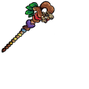 | Airenzhaohuanzhang | `airenzhaohuanzhang` | Vũ khí | Chưa có mô tả tiếng Việt trong bảng chuỗi của mod. | `scripts/prefabs/airenfazhang.lua` |
| 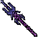 | Anheichangqiang | `anheichangqiang` | Vũ khí | Chưa có mô tả tiếng Việt trong bảng chuỗi của mod. | `scripts/prefabs/anheichangqiang.lua` |
| 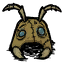 | Mũ Giáp Kiến Sư Tử | `antmask` | Giáp | Giúp bạn ngụy trang thành một con Kiến Sư Tử | `scripts/prefabs/antmask.lua` |
| 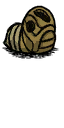 | Giáp Tấm Kiến Sư Tử | `antsuit` | Giáp | Giúp bạn ngụy trang thành một con Kiến Sư Tử | `scripts/prefabs/antsuit.lua` |
|  | Anyinglinpian | `anyinglinpian` | Thức ăn & Thuốc | Chưa có mô tả tiếng Việt trong bảng chuỗi của mod. | `scripts/prefabs/anyinglinpian.lua` |
|  | Mũ Giáp Bóng Đêm | `anyingtoukui` | Giáp | Đồng hành cùng bóng tối (kích hoạt hiệu ứng bộ trang bị sẽ dùng tinh thần để gánh chịu sát thương) | `scripts/prefabs/anyingtoukui.lua` |
| 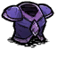 | Anyingxiongjia | `anyingxiongjia` | Giáp | Điều khiển nguồn sức mạnh bóng tối vô biên (kích hoạt hiệu ứng trọn bộ trang bị sẽ chuyển hóa tinh thần lực để gánh chịu sát thương thay cho máu) | `scripts/prefabs/anyingxiongjia.lua` |
|  | Anyingzhu | `anyingzhu` | Biểu tượng & Khác | Chưa có mô tả tiếng Việt trong bảng chuỗi của mod. | Chưa ghép được prefab |
| 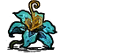 | Aomihua | `aomihua` | Phụ kiện | Tự động uống thuốc mana khi cạn kiệt, đồng thời làm giảm chỉ số thù hận và sự chú ý của kẻ địch lên bạn | `scripts/prefabs/aomihua.lua` |
|  | Aoshushuijing | `aoshushuijing` | Phụ kiện | Tăng tốc độ hồi phục năng lượng ma pháp. Khi sử dụng vũ khí dạng bắn đạn, tự động bắn thêm 3 luồng đạn ma thuật | `scripts/prefabs/aoshushuijing.lua` |
| 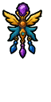 | Aoxiangzhizheng | `aoxiangzhizheng` | Phụ kiện | Chưa có mô tả tiếng Việt trong bảng chuỗi của mod. | `scripts/prefabs/aoxiangzhizheng.lua` |
| 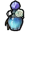 | Baicaoqionglu | `baicaoqionglu` | Biểu tượng & Khác | Chưa có mô tả tiếng Việt trong bảng chuỗi của mod. | Chưa ghép được prefab |
|  | Baitao Zhangui | `baitao_zhangui` | Công trình | Chưa có mô tả tiếng Việt trong bảng chuỗi của mod. | `scripts/prefabs/baitao_zhangui.lua` |
| 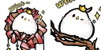 | Baiyu Item | `baiyu_item` | Biểu tượng & Khác | Chưa có mô tả tiếng Việt trong bảng chuỗi của mod. | Chưa ghép được prefab |
|  | Banboyouyu | `banboyouyu` | Thức ăn & Thuốc | Chưa có mô tả tiếng Việt trong bảng chuỗi của mod. | `scripts/prefabs/tr_fish.lua` |
|  | Banbozhihun | `banbozhihun` | Phụ kiện | Tăng 3 ô triệu hồi và tăng 45% sát thương cho đệ tử triệu hồi | `scripts/prefabs/banbozhihun.lua` |
|  | Kẹo Bông Gòn Que | `bangbangmianhuatang` | Vũ khí | Vừa chiến đấu vừa nhâm nhi kẹo ngon! Mỗi đòn đánh hồi phục 1 độ đói | `scripts/prefabs/bangbangmianhuatang.lua` |
|  | Bangbangmianhuatang Sancaituanzi | `bangbangmianhuatang_sancaituanzi` | Biểu tượng & Khác | Chưa có mô tả tiếng Việt trong bảng chuỗi của mod. | Chưa ghép được prefab |
| 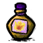 | Baonuanyaoshui | `baonuanyaoshui` | Thức ăn & Thuốc | Giúp giữ ấm cơ thể ở mức 40 độ C, tối đa không quá 40 độ C (không có tác dụng khi thân nhiệt trên 40 độ C) | `scripts/prefabs/tr_yaoshui.lua` |
| 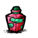 | Baonuyaoshui | `baonuyaoshui` | Thức ăn & Thuốc | Trong 8 phút tiếp theo, đòn đánh có 10% cơ hội gây bạo kích, sát thương x2 | `scripts/prefabs/tr_yaoshui.lua` |
| 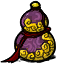 | Baoshi | `baoshi` | Thức ăn & Thuốc | Chưa có mô tả tiếng Việt trong bảng chuỗi của mod. | `scripts/prefabs/trhulu.lua` |
|  | Baoshihua | `baoshihua` | Phụ kiện | Chưa có mô tả tiếng Việt trong bảng chuỗi của mod. | `scripts/prefabs/baoshihua.lua` |
|  | Baoshijingcu | `baoshijingcu` | Thức ăn & Thuốc | Chưa có mô tả tiếng Việt trong bảng chuỗi của mod. | `scripts/prefabs/baoshijingcu.lua` |
| 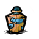 | Baoxiayaoshui | `baoxiayaoshui` | Thức ăn & Thuốc | Tăng 20% cơ hội câu được hòm kho báu | `scripts/prefabs/tr_yaoshui.lua` |
|  | Bingmeiguojiangjuan | `bingmeiguojiangjuan` | Vũ khí | Chưa có mô tả tiếng Việt trong bảng chuỗi của mod. | Chưa ghép được prefab |
|  | Bingxuegong | `bingxuegong` | Vũ khí | Tự động biến đổi mũi tên thường thành những nhọn băng sắc lạnh thấu xương | `scripts/prefabs/mugong.lua` |
| 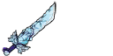 | Bingxueren | `bingxueren` | Vũ khí | Chưa có mô tả tiếng Việt trong bảng chuỗi của mod. | `scripts/prefabs/bingxueren.lua` |
| 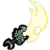 | Bingxueren Zhutianshiyue | `bingxueren_zhutianshiyue` | Biểu tượng & Khác | Chưa có mô tả tiếng Việt trong bảng chuỗi của mod. | Chưa ghép được prefab |
|  | Bkm Image | `bkm_image` | Biểu tượng & Khác | Chưa có mô tả tiếng Việt trong bảng chuỗi của mod. | Chưa ghép được prefab |
|  | Black Jingzhuangti | `black_jingzhuangti` | Thức ăn & Thuốc | Chưa có mô tả tiếng Việt trong bảng chuỗi của mod. | `scripts/prefabs/black_jingzhuangti.lua` |
|  | Black Soul | `black_soul` | Nguyên liệu & Vật phẩm | Chưa có mô tả tiếng Việt trong bảng chuỗi của mod. | `scripts/prefabs/black_soul.lua` |
| 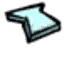 | Thủy Tinh | `boli` | Thức ăn & Thuốc | Được nung chảy từ cát trắng | `scripts/prefabs/boli.lua` |
| 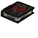 | Book | `book` | Vũ khí | Chưa có mô tả tiếng Việt trong bảng chuỗi của mod. | `scripts/prefabs/book.lua` |
|  | Caihongmaozhiren | `caihongmaozhiren` | Vũ khí | Chưa có mô tả tiếng Việt trong bảng chuỗi của mod. | `scripts/prefabs/miaodao.lua` |
|  | Cangyu | `cangyu` | Biểu tượng & Khác | Chưa có mô tả tiếng Việt trong bảng chuỗi của mod. | Chưa ghép được prefab |
| 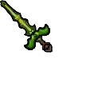 | Kiếm Thảo Trĩ | `caotijian` | Vũ khí | Hãy hấp thụ dưỡng chất từ chính xác thịt kẻ thù! | `scripts/prefabs/caotijian.lua` |
|  | Caozhimao | `caozhimao` | Biểu tượng & Khác | Chưa có mô tả tiếng Việt trong bảng chuỗi của mod. | Chưa ghép được prefab |
|  | Catbeijing | `catbeijing` | Biểu tượng & Khác | Chưa có mô tả tiếng Việt trong bảng chuỗi của mod. | Chưa ghép được prefab |
|  | Ccs Cards 20 | `ccs_cards_20` | Biểu tượng & Khác | Chưa có mô tả tiếng Việt trong bảng chuỗi của mod. | Chưa ghép được prefab |
| 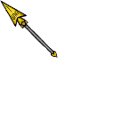 | Thương Dài | `changmao` | Vũ khí | Sắc bén hơn gấp bội, gây thêm 20 sát thương chuẩn | `scripts/prefabs/changmao.lua` |
| 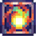 | Chaoweibengjie | `chaoweibengjie` | Biểu tượng & Khác | Chưa có mô tả tiếng Việt trong bảng chuỗi của mod. | `scripts/prefabs/chaoweibengjiefx.lua` |
| 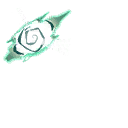 | Chaozailiexihuiguang | `chaozailiexihuiguang` | Biểu tượng & Khác | Chưa có mô tả tiếng Việt trong bảng chuỗi của mod. | Chưa ghép được prefab |
| 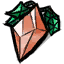 | Quả Cam Ngọc | `chengbaoshiguo` | Biểu tượng & Khác | Quả Cam Ngọc | Chưa ghép được prefab |
|  | Cây Cam Ngọc | `chengbaoshishu` | Biểu tượng & Khác | Chưa có mô tả tiếng Việt trong bảng chuỗi của mod. | Chưa ghép được prefab |
| 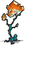 | Chengbaoshishu A Huiguangxiangshu | `chengbaoshishu_a_huiguangxiangshu` | Biểu tượng & Khác | Chưa có mô tả tiếng Việt trong bảng chuỗi của mod. | Chưa ghép được prefab |
| 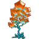 | Chengbaoshishu Huiguangxiangshu | `chengbaoshishu_huiguangxiangshu` | Biểu tượng & Khác | Chưa có mô tả tiếng Việt trong bảng chuỗi của mod. | Chưa ghép được prefab |
| 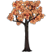 | Chengbaoshishu Normal | `chengbaoshishu_normal` | Biểu tượng & Khác | Chưa có mô tả tiếng Việt trong bảng chuỗi của mod. | Chưa ghép được prefab |
|  | Chengbaoshishu Paopaogu | `chengbaoshishu_paopaogu` | Biểu tượng & Khác | Chưa có mô tả tiếng Việt trong bảng chuỗi của mod. | Chưa ghép được prefab |
| 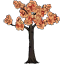 | Chengbaoshishu Short | `chengbaoshishu_short` | Biểu tượng & Khác | Chưa có mô tả tiếng Việt trong bảng chuỗi của mod. | Chưa ghép được prefab |
|  | Chengbaoshishu Stump | `chengbaoshishu_stump` | Biểu tượng & Khác | Chưa có mô tả tiếng Việt trong bảng chuỗi của mod. | Chưa ghép được prefab |
|  | Chengbaoshishu Tall | `chengbaoshishu_tall` | Biểu tượng & Khác | Chưa có mô tả tiếng Việt trong bảng chuỗi của mod. | Chưa ghép được prefab |
| 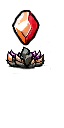 | Chengsejingta | `chengsejingta` | Công trình | Chưa có mô tả tiếng Việt trong bảng chuỗi của mod. | `scripts/prefabs/chengsejingta.lua` |
| 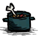 | Chidebao | `chidebao` | Biểu tượng & Khác | Chưa có mô tả tiếng Việt trong bảng chuỗi của mod. | Chưa ghép được prefab |
| 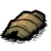 | Chitin | `chitin` | Nguyên liệu & Vật phẩm | Chưa có mô tả tiếng Việt trong bảng chuỗi của mod. | `scripts/prefabs/chitin.lua` |
| 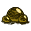 | Trứng Kiến Sư Tử | `chitinluan` | Biểu tượng & Khác | Khối trứng nhúc nhích bốc mùi hôi thối khó chịu | Chưa ghép được prefab |
|  | Chixinxunxiangping | `chixinxunxiangping` | Phụ kiện | Cung cấp hiệu ứng hồi máu liên tục cho bản thân và đồng đội trong phạm vi dựa theo tỷ lệ lượng máu hiện tại của người sở hữu | `scripts/prefabs/chixinxunxiangping.lua` |
| 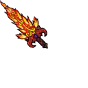 | Đại Kiếm Rực Lửa | `chiyanjujian` | Vũ khí | Được tạo ra từ ngọn lửa rực cháy!' | `scripts/prefabs/chiyanjujian.lua` |
| 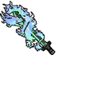 | Chiyanjujian Cangyan | `chiyanjujian_cangyan` | Vũ khí | Chưa có mô tả tiếng Việt trong bảng chuỗi của mod. | Chưa ghép được prefab |
| 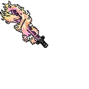 | Chiyanjujian Yanwu | `chiyanjujian_yanwu` | Vũ khí | Chưa có mô tả tiếng Việt trong bảng chuỗi của mod. | Chưa ghép được prefab |
| 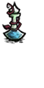 | Thuốc Lỗ Sâu | `chongdongyaoshui` | Thức ăn & Thuốc | Dịch chuyển lập tức đến bên cạnh một người đồng đội trong nhóm | `scripts/prefabs/chongdongyaoshui.lua` |
| 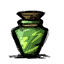 | Chouweiyaoshui | `chouweiyaoshui` | Thức ăn & Thuốc | Lập tức xóa bỏ thù hận của kẻ địch trên diện rộng, đồng thời khiến chúng không thể chủ động tấn công bạn trong 1 phút | `scripts/prefabs/tr_yaoshui.lua` |
| 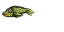 | Chouweiyu | `chouweiyu` | Thức ăn & Thuốc | Chưa có mô tả tiếng Việt trong bảng chuỗi của mod. | `scripts/prefabs/tr_fish.lua` |
| 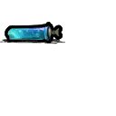 | Chunjingjiaozhi | `chunjingjiaozhi` | Phụ kiện | Chưa có mô tả tiếng Việt trong bảng chuỗi của mod. | `scripts/prefabs/ningjiaoshipin.lua` |
|  | Chushoumao | `chushoumao` | Biểu tượng & Khác | Chưa có mô tả tiếng Việt trong bảng chuỗi của mod. | Chưa ghép được prefab |
|  | Bào Tử Rừng Rậm | `conglinbaozi` | Thức ăn & Thuốc | Tinh hoa từ các sinh vật nơi rừng rậm, dùng để chế tạo các vật phẩm mang thuộc tính rừng | `scripts/prefabs/conglinbaozi.lua` |
| 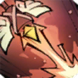 | Cuilianimg | `cuilianimg` | Biểu tượng & Khác | Chưa có mô tả tiếng Việt trong bảng chuỗi của mod. | Chưa ghép được prefab |
| 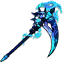 | Cuiqu | `cuiqu` | Biểu tượng & Khác | Chưa có mô tả tiếng Việt trong bảng chuỗi của mod. | Chưa ghép được prefab |
|  | Dafashihuiyin | `dafashihuiyin` | Phụ kiện | Tăng tốc độ hồi mana, đồng thời mỗi đòn tấn công sẽ bắn thêm 6 luồng đạn ma thuật sắc lẹm | `scripts/prefabs/dafashihuiyin.lua` |
| 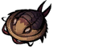 | Dalishijiachong | `dalishijiachong` | Phụ kiện | Chưa có mô tả tiếng Việt trong bảng chuỗi của mod. | `scripts/prefabs/dalishijiachong.lua` |
| 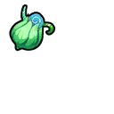 | Dazirandeenci | `dazirandeenci` | Nguyên liệu & Vật phẩm | Dường như là một đóa hoa nhỏ màu xanh lam kỳ diệu mãi mãi không bao giờ tàn úa | `scripts/prefabs/dazirandeenci.lua` |
| 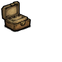 | Diaojuxiang | `diaojuxiang` | Biểu tượng & Khác | Chưa có mô tả tiếng Việt trong bảng chuỗi của mod. | Chưa ghép được prefab |
|  | Diaoyuyaoshui | `diaoyuyaoshui` | Thức ăn & Thuốc | Tăng 50% tốc độ câu cá | `scripts/prefabs/tr_yaoshui.lua` |
| 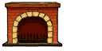 | Diyuronglu | `diyuronglu` | Biểu tượng & Khác | Chưa có mô tả tiếng Việt trong bảng chuỗi của mod. | Chưa ghép được prefab |
| 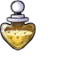 | Dongxuetanxianyaoshui | `dongxuetanxianyaoshui` | Thức ăn & Thuốc | Chưa có mô tả tiếng Việt trong bảng chuỗi của mod. | `scripts/prefabs/tr_yaoshui.lua` |
| 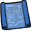 | Drop Blueprint | `drop_blueprint` | Biểu tượng & Khác | Chưa có mô tả tiếng Việt trong bảng chuỗi của mod. | Chưa ghép được prefab |
| 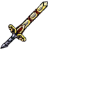 | Duangangjian | `duangangjian` | Vũ khí | Thanh thần kiếm sắc lẹm có thể dễ dàng cắt sắt chém thép như chém bùn | `scripts/prefabs/duangangjian.lua` |
| 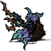 | Rễ Gai Rùng Mình | `dug_hanchanji_plant` | Biểu tượng & Khác | Gieo trồng ra những đóa hoa tỏa ra hơi lạnh băng giá thấu xương | Chưa ghép được prefab |
| 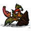 | Rễ Hoa Lửa | `dug_huoyanhua_plant` | Biểu tượng & Khác | Gieo trồng ra những đóa hoa rực cháy như ngọn lửa bập bùng | Chưa ghép được prefab |
| 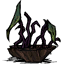 | Phần Rễ Của Rễ Lấp Lánh | `dug_shanyaogen_plant` | Biểu tượng & Khác | Gieo xuống đất để mọc lên những vì sao bé nhỏ tinh khôi | Chưa ghép được prefab |
| 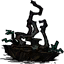 | Rễ Cỏ Tử Vong | `dug_siwangcao_plant` | Biểu tượng & Khác | Gieo trồng và gặt hái những trái cấm mang hương vị tử vong | Chưa ghép được prefab |
|  | Dugu | `dugu` | Thức ăn & Thuốc | Chưa có mô tả tiếng Việt trong bảng chuỗi của mod. | `scripts/prefabs/mogu_pick.lua` |
|  | Dugu Cook | `dugu_cook` | Thức ăn & Thuốc | Chưa có mô tả tiếng Việt trong bảng chuỗi của mod. | `scripts/prefabs/mogu_cook.lua` |
|  | Electric shock | `electric shock` | Biểu tượng & Khác | Chưa có mô tả tiếng Việt trong bảng chuỗi của mod. | Chưa ghép được prefab |
|  | Emojitan Emomaomao | `emojitan_emomaomao` | Biểu tượng & Khác | Chưa có mô tả tiếng Việt trong bảng chuỗi của mod. | Chưa ghép được prefab |
|  | Emojitan Qicai | `emojitan_qicai` | Biểu tượng & Khác | Chưa có mô tả tiếng Việt trong bảng chuỗi của mod. | Chưa ghép được prefab |
|  | Emojitan Wangzuo | `emojitan_wangzuo` | Biểu tượng & Khác | Chưa có mô tả tiếng Việt trong bảng chuỗi của mod. | Chưa ghép được prefab |
|  | Emozhixin | `emozhixin` | Kho chứa | Hiến tế linh hồn của bạn | `scripts/prefabs/emozhixin.lua` |
|  | Emozhiyi | `emozhiyi` | Kho chứa | Phồng lớn lên và giăng mở thành đôi cánh ác quỷ sải rộng uy nghi | `scripts/prefabs/emozhiyi.lua` |
|  | Erbenzhishi | `erbenzhishi` | Công trình | Chưa có mô tả tiếng Việt trong bảng chuỗi của mod. | `scripts/prefabs/yasuomokuai.lua` |
|  | Fangyusunshang | `fangyusunshang` | Biểu tượng & Khác | Chưa có mô tả tiếng Việt trong bảng chuỗi của mod. | Chưa ghép được prefab |
|  | Fanhundie | `fanhundie` | Vũ khí | Quy luật tất yếu của nhân sinh: phàm là sinh linh ắt có ngày tàn diệt | `scripts/prefabs/fanhundie.lua` |
|  | Fanhundie Liuli | `fanhundie_liuli` | Biểu tượng & Khác | Chưa có mô tả tiếng Việt trong bảng chuỗi của mod. | Chưa ghép được prefab |
|  | Fanhundie Qingluandanfeng | `fanhundie_qingluandanfeng` | Biểu tượng & Khác | Chưa có mô tả tiếng Việt trong bảng chuỗi của mod. | Chưa ghép được prefab |
|  | Fanhundie Wanyunshuang | `fanhundie_wanyunshuang` | Biểu tượng & Khác | Chưa có mô tả tiếng Việt trong bảng chuỗi của mod. | Chưa ghép được prefab |
|  | Fanzuzhouzhouyu | `fanzuzhouzhouyu` | Phụ kiện | Thanh tẩy lời nguyền, miễn nhiễm lời nguyền hóa khỉ, đồng thời định kỳ trò chuyện và truyền năng lượng sống cho cây trồng trong phạm vi vừa phải | `scripts/prefabs/fanzuzhouzhouyu.lua` |
|  | Fashixunzhang | `fashixunzhang` | Biểu tượng & Khác | Chưa có mô tả tiếng Việt trong bảng chuỗi của mod. | `scripts/prefabs/fashixunzhang.lua` |
|  | Fazhenbeijing | `fazhenbeijing` | Biểu tượng & Khác | Chưa có mô tả tiếng Việt trong bảng chuỗi của mod. | Chưa ghép được prefab |
|  | Fazhenbeijinghong | `fazhenbeijinghong` | Biểu tượng & Khác | Chưa có mô tả tiếng Việt trong bảng chuỗi của mod. | Chưa ghép được prefab |
|  | Fazhenbeijinghuang | `fazhenbeijinghuang` | Biểu tượng & Khác | Chưa có mô tả tiếng Việt trong bảng chuỗi của mod. | Chưa ghép được prefab |
|  | Fazhenbeijinglan | `fazhenbeijinglan` | Biểu tượng & Khác | Chưa có mô tả tiếng Việt trong bảng chuỗi của mod. | Chưa ghép được prefab |
|  | Fazhenbeijingzi | `fazhenbeijingzi` | Biểu tượng & Khác | Chưa có mô tả tiếng Việt trong bảng chuỗi của mod. | Chưa ghép được prefab |
|  | Feixiangzhihun | `feixiangzhihun` | Biểu tượng & Khác | Chưa có mô tả tiếng Việt trong bảng chuỗi của mod. | Chưa ghép được prefab |
|  | Feiyingliuguang | `feiyingliuguang` | Biểu tượng & Khác | Tôi đã nhìn thấy những đốm lửa đom đóm rực rỡ bay lượn trong đêm | `scripts/prefabs/feiyingliuguang.lua` |
|  | Fengchao | `fengchao` | Phụ kiện | Chưa có mô tả tiếng Việt trong bảng chuỗi của mod. | `scripts/prefabs/fengchao.lua` |
|  | Fengmiping | `fengmiping` | Thức ăn & Thuốc | Lập tức hồi phục 25 máu, đồng thời bổ sung thêm 25 chỉ số phụ trợ | `scripts/prefabs/fengmiping.lua` |
|  | Fengmishuijing | `fengmishuijing` | Biểu tượng & Khác | Chưa có mô tả tiếng Việt trong bảng chuỗi của mod. | Chưa ghép được prefab |
|  | Fh Baozangdai | `fh_baozangdai` | Kho chứa | Chưa có mô tả tiếng Việt trong bảng chuỗi của mod. | `scripts/prefabs/fh_baozangdai.lua` |
|  | Firehuahua | `firehuahua` | Biểu tượng & Khác | Chưa có mô tả tiếng Việt trong bảng chuỗi của mod. | Chưa ghép được prefab |
|  | Fuchouxunzhang | `fuchouxunzhang` | Phụ kiện | Chưa có mô tả tiếng Việt trong bảng chuỗi của mod. | `scripts/prefabs/fuchouzhehuizhang.lua` |
|  | Fuguitongqian | `fuguitongqian` | Kho chứa | Nó cất tiếng thì thầm, kể lại những bí mật về kho báu cổ đại và cám dỗ bạn dấn thân vào chốn phiêu lưu | `scripts/prefabs/fuguitongqian.lua` |
|  | Fuwenzhige | `fuwenzhige` | Vũ khí | Chưa có mô tả tiếng Việt trong bảng chuỗi của mod. | `scripts/prefabs/fuwenzhige.lua` |
|  | Túi Thơm Gây Mùi | `fuxiangnang` | Phụ kiện | Khiến kẻ địch cảm thấy khó chịu và ít có khả năng nhắm bạn làm mục tiêu ưu tiên | `scripts/prefabs/fuxiangnang.lua` |
|  | Gaofu | `gaofu` | Vũ khí | Chưa có mô tả tiếng Việt trong bảng chuỗi của mod. | `scripts/prefabs/tr_gaofu.lua` |
|  | Gaofu Qicai | `gaofu_qicai` | Biểu tượng & Khác | Chưa có mô tả tiếng Việt trong bảng chuỗi của mod. | Chưa ghép được prefab |
|  | Glowfly | `glowfly` | Công trình | Chưa có mô tả tiếng Việt trong bảng chuỗi của mod. | `scripts/prefabs/glowfly.lua` |
|  | Gongjian | `gongjian` | Vũ khí | Chưa có mô tả tiếng Việt trong bảng chuỗi của mod. | Chưa ghép được prefab |
|  | Gongjiangzuofang | `gongjiangzuofang` | Vũ khí | Bàn làm việc chuyên dụng để chế tác vô số phụ kiện và trang sức trang bị | `scripts/prefabs/gongjiangzuofang.lua` |
|  | Gongjiangzuofang Jiangpintanwei | `gongjiangzuofang_jiangpintanwei` | Vũ khí | Chưa có mô tả tiếng Việt trong bảng chuỗi của mod. | Chưa ghép được prefab |
|  | Gongjiangzuofang Tianshenxiang | `gongjiangzuofang_tianshenxiang` | Vũ khí | Chưa có mô tả tiếng Việt trong bảng chuỗi của mod. | Chưa ghép được prefab |
|  | Guangmangyaoshui | `guangmangyaoshui` | Thức ăn & Thuốc | Phát sáng xung quanh trong 8 phút | `scripts/prefabs/tr_yaoshui.lua` |
|  | Guhudun | `guhudun` | Phụ kiện | Giúp bạn chống lại hiệu ứng hất tung (chuyển bị hất tung thành bị đẩy lùi nhẹ) | `scripts/prefabs/guhudun.lua` |
|  | Guixuzhiling | `guixuzhiling` | Biểu tượng & Khác | Chưa có mô tả tiếng Việt trong bảng chuỗi của mod. | `scripts/prefabs/guixuzhiling.lua` |
|  | Guozainengliangkuai | `guozainengliangkuai` | Thức ăn & Thuốc | Chưa có mô tả tiếng Việt trong bảng chuỗi của mod. | `scripts/prefabs/guozainengliangkuai.lua` |
|  | Guozainengliangkuai Caomeibuding | `guozainengliangkuai_caomeibuding` | Thức ăn & Thuốc | Chưa có mô tả tiếng Việt trong bảng chuỗi của mod. | `scripts/prefabs/guozainengliangkuai.lua` |
|  | Gushendediyuezhizheng | `gushendediyuezhizheng` | Phụ kiện | Chưa có mô tả tiếng Việt trong bảng chuỗi của mod. | `scripts/prefabs/gushendediyuezhizheng.lua` |
|  | Trượng Hải Tặc | `haidaofazhang` | Vũ khí | Chưa có mô tả tiếng Việt trong bảng chuỗi của mod. | `scripts/prefabs/haidaofazhang.lua` |
|  | Haigufashu | `haigufashu` | Vũ khí | Chưa có mô tả tiếng Việt trong bảng chuỗi của mod. | `scripts/prefabs/haigufashu.lua` |
|  | Haigutoukui | `haigutoukui` | Giáp | Chưa có mô tả tiếng Việt trong bảng chuỗi của mod. | Chưa ghép được prefab |
|  | Haishenbeike | `haishenbeike` | Phụ kiện | Khi trang bị bên người cho phép bước đi nhẹ nhàng trên mặt nước như đi trên đất liền | `scripts/prefabs/haishenbeike.lua` |
|  | Haishensanchaji | `haishensanchaji` | Vũ khí | Chưa có mô tả tiếng Việt trong bảng chuỗi của mod. | `scripts/prefabs/haishensanchaji.lua` |
|  | Haixingmozun | `haixingmozun` | Biểu tượng & Khác | Ma Tôn Hải Tinh | `scripts/prefabs/haixingmozun.lua` |
|  | Haixingmozun A | `haixingmozun_a` | Biểu tượng & Khác | Chưa có mô tả tiếng Việt trong bảng chuỗi của mod. | Chưa ghép được prefab |
|  | Haixingmozun B | `haixingmozun_b` | Biểu tượng & Khác | Chưa có mô tả tiếng Việt trong bảng chuỗi của mod. | Chưa ghép được prefab |
|  | Haixingmozun C | `haixingmozun_c` | Biểu tượng & Khác | Chưa có mô tả tiếng Việt trong bảng chuỗi của mod. | Chưa ghép được prefab |
|  | Haixingmozun Er | `haixingmozun_er` | Biểu tượng & Khác | Chưa có mô tả tiếng Việt trong bảng chuỗi của mod. | Chưa ghép được prefab |
|  | Haixingmozun San | `haixingmozun_san` | Biểu tượng & Khác | Chưa có mô tả tiếng Việt trong bảng chuỗi của mod. | Chưa ghép được prefab |
|  | Hamletinventory | `hamletinventory` | Biểu tượng & Khác | Chưa có mô tả tiếng Việt trong bảng chuỗi của mod. | Chưa ghép được prefab |
|  | Gai Rùng Mình | `hanchanji` | Biểu tượng & Khác | Chưa có mô tả tiếng Việt trong bảng chuỗi của mod. | Chưa ghép được prefab |
|  | Cây Gai Rùng Mình | `hanchanji_plant` | Biểu tượng & Khác | Chưa có mô tả tiếng Việt trong bảng chuỗi của mod. | Chưa ghép được prefab |
|  | Hanchanji Plant Mangguotiantong | `hanchanji_plant_mangguotiantong` | Biểu tượng & Khác | Chưa có mô tả tiếng Việt trong bảng chuỗi của mod. | Chưa ghép được prefab |
|  | Hanshuangfuzhui | `hanshuangfuzhui` | Phụ kiện | Hoàn toàn miễn nhiễm với sốc nhiệt và sát thương từ lửa | `scripts/prefabs/hanshuangfuzhui.lua` |
|  | Hanshuangtiaoyu | `hanshuangtiaoyu` | Biểu tượng & Khác | Chưa có mô tả tiếng Việt trong bảng chuỗi của mod. | Chưa ghép được prefab |
|  | Hanshuangzhihua | `hanshuangzhihua` | Biểu tượng & Khác | Chưa có mô tả tiếng Việt trong bảng chuỗi của mod. | Chưa ghép được prefab |
|  | Heermosizhixue | `heermosizhixue` | Phụ kiện | Sức mạnh ban phước từ vị thần phương Tây | `scripts/prefabs/heermosizhixue.lua` |
|  | Heishiyu | `heishiyu` | Thức ăn & Thuốc | Chưa có mô tả tiếng Việt trong bảng chuỗi của mod. | `scripts/prefabs/tr_fish.lua` |
|  | Heitanjinli | `heitanjinli` | Thức ăn & Thuốc | Chưa có mô tả tiếng Việt trong bảng chuỗi của mod. | `scripts/prefabs/tr_fish.lua` |
|  | Heiyaoshi | `heiyaoshi` | Thức ăn & Thuốc | Chưa có mô tả tiếng Việt trong bảng chuỗi của mod. | `scripts/prefabs/heiyaoshi.lua` |
|  | Heiyaoshihudun | `heiyaoshihudun` | Phụ kiện | Miễn nhiễm sát thương từ lửa, giảm 15% sát thương gánh chịu và chống lại hiệu ứng hất tung | `scripts/prefabs/heiyaoshihudun.lua` |
|  | Heiyaoshikulou | `heiyaoshikulou` | Phụ kiện | Giúp bạn hoàn toàn miễn nhiễm với sát thương từ lửa | `scripts/prefabs/heiyaoshikulou.lua` |
|  | Heiyaoshisuohe | `heiyaoshisuohe` | Kho chứa | Chưa có mô tả tiếng Việt trong bảng chuỗi của mod. | `scripts/prefabs/heiyaoshisuohe.lua` |
|  | Heiyaoshixia | `heiyaoshixia` | Kho chứa | Chưa có mô tả tiếng Việt trong bảng chuỗi của mod. | `scripts/prefabs/heiyaoshixia.lua` |
|  | Heiyaoshiyaoshui | `heiyaoshiyaoshui` | Thức ăn & Thuốc | Miễn nhiễm sát thương từ lửa trong 16 phút | `scripts/prefabs/tr_yaoshui.lua` |
|  | Heiyaoshiyu | `heiyaoshiyu` | Thức ăn & Thuốc | Chưa có mô tả tiếng Việt trong bảng chuỗi của mod. | `scripts/prefabs/tr_fish.lua` |
|  | Quả Hồng Ngọc | `hongbaoshiguo` | Biểu tượng & Khác | Quả Hồng Ngọc | Chưa ghép được prefab |
|  | Cây Hồng Ngọc | `hongbaoshishu` | Biểu tượng & Khác | Chưa có mô tả tiếng Việt trong bảng chuỗi của mod. | Chưa ghép được prefab |
|  | Hongbaoshishu A Huiguangxiangshu | `hongbaoshishu_a_huiguangxiangshu` | Biểu tượng & Khác | Chưa có mô tả tiếng Việt trong bảng chuỗi của mod. | Chưa ghép được prefab |
|  | Hongbaoshishu Huiguangxiangshu | `hongbaoshishu_huiguangxiangshu` | Biểu tượng & Khác | Chưa có mô tả tiếng Việt trong bảng chuỗi của mod. | Chưa ghép được prefab |
|  | Hongbaoshishu Normal | `hongbaoshishu_normal` | Biểu tượng & Khác | Chưa có mô tả tiếng Việt trong bảng chuỗi của mod. | Chưa ghép được prefab |
|  | Hongbaoshishu Paopaogu | `hongbaoshishu_paopaogu` | Biểu tượng & Khác | Chưa có mô tả tiếng Việt trong bảng chuỗi của mod. | Chưa ghép được prefab |
|  | Hongbaoshishu Short | `hongbaoshishu_short` | Biểu tượng & Khác | Chưa có mô tả tiếng Việt trong bảng chuỗi của mod. | Chưa ghép được prefab |
|  | Hongbaoshishu Stump | `hongbaoshishu_stump` | Biểu tượng & Khác | Chưa có mô tả tiếng Việt trong bảng chuỗi của mod. | Chưa ghép được prefab |
|  | Hongbaoshishu Tall | `hongbaoshishu_tall` | Biểu tượng & Khác | Chưa có mô tả tiếng Việt trong bảng chuỗi của mod. | Chưa ghép được prefab |
|  | Hongsejingta | `hongsejingta` | Công trình | Chưa có mô tả tiếng Việt trong bảng chuỗi của mod. | `scripts/prefabs/hongsejingta.lua` |
|  | House Pieces | `house_pieces` | Biểu tượng & Khác | Chưa có mô tả tiếng Việt trong bảng chuỗi của mod. | Chưa ghép được prefab |
|  | Huajingshoupa | `huajingshoupa` | Phụ kiện | Chiếc khăn tay mềm mại tỏa ra mùi thơm hoa cỏ thoang thoảng dịu êm | `scripts/prefabs/huajingshoupa.lua` |
|  | Huamumao | `huamumao` | Biểu tượng & Khác | Chưa có mô tả tiếng Việt trong bảng chuỗi của mod. | Chưa ghép được prefab |
|  | Quả Hoàng Ngọc | `huangbaoshiguo` | Biểu tượng & Khác | Quả Hoàng Ngọc | Chưa ghép được prefab |
|  | Cây Hoàng Ngọc | `huangbaoshishu` | Biểu tượng & Khác | Chưa có mô tả tiếng Việt trong bảng chuỗi của mod. | Chưa ghép được prefab |
|  | Huangbaoshishu A Huiguangxiangshu | `huangbaoshishu_a_huiguangxiangshu` | Biểu tượng & Khác | Chưa có mô tả tiếng Việt trong bảng chuỗi của mod. | Chưa ghép được prefab |
|  | Huangbaoshishu Huiguangxiangshu | `huangbaoshishu_huiguangxiangshu` | Biểu tượng & Khác | Chưa có mô tả tiếng Việt trong bảng chuỗi của mod. | Chưa ghép được prefab |
|  | Huangbaoshishu Normal | `huangbaoshishu_normal` | Biểu tượng & Khác | Chưa có mô tả tiếng Việt trong bảng chuỗi của mod. | Chưa ghép được prefab |
|  | Huangbaoshishu Paopaogu | `huangbaoshishu_paopaogu` | Biểu tượng & Khác | Chưa có mô tả tiếng Việt trong bảng chuỗi của mod. | Chưa ghép được prefab |
|  | Huangbaoshishu Short | `huangbaoshishu_short` | Biểu tượng & Khác | Chưa có mô tả tiếng Việt trong bảng chuỗi của mod. | Chưa ghép được prefab |
|  | Huangbaoshishu Stump | `huangbaoshishu_stump` | Biểu tượng & Khác | Chưa có mô tả tiếng Việt trong bảng chuỗi của mod. | Chưa ghép được prefab |
|  | Huangbaoshishu Tall | `huangbaoshishu_tall` | Biểu tượng & Khác | Chưa có mô tả tiếng Việt trong bảng chuỗi của mod. | Chưa ghép được prefab |
|  | Huangfengfazhang | `huangfengfazhang` | Vũ khí | Chưa có mô tả tiếng Việt trong bảng chuỗi của mod. | `scripts/prefabs/huangfengfazhang.lua` |
|  | Trượng Triệu Hồi Ong Vàng | `huangfengzhaohuanzhang` | Vũ khí | Đã đến lúc tìm kiếm vài chú ong chăm chỉ làm trợ thủ đắc lực rồi! | `scripts/prefabs/huangfengzhaohuanzhang.lua` |
|  | Huangjianingjiao | `huangjianingjiao` | Vũ khí | Chưa có mô tả tiếng Việt trong bảng chuỗi của mod. | `scripts/prefabs/huangjianingjiao.lua` |
|  | Huangsejingta | `huangsejingta` | Công trình | Chưa có mô tả tiếng Việt trong bảng chuỗi của mod. | `scripts/prefabs/huangsejingta.lua` |
|  | Trượng Tia Lửa | `huohuamobang` | Vũ khí | Bắn ra những tia lửa rực cháy khiến mục tiêu bị thiêu đốt | `scripts/prefabs/huohuamobang.lua` |
|  | Huolijiaozhi | `huolijiaozhi` | Phụ kiện | Chưa có mô tả tiếng Việt trong bảng chuỗi của mod. | `scripts/prefabs/ningjiaoshipin.lua` |
|  | Huoliyaoshuiping | `huoliyaoshuiping` | Thức ăn & Thuốc | Cung cấp thêm tốc độ di chuyển và hiệu ứng tinh thể mật ong, mang lại cảm giác ngọt ngào ấm áp như đang ngâm mình trong hồ mật | `scripts/prefabs/huoliyaoshuiping.lua` |
|  | Hoa Lửa | `huoyanhua` | Biểu tượng & Khác | Chưa có mô tả tiếng Việt trong bảng chuỗi của mod. | Chưa ghép được prefab |
|  | Cây Hoa Lửa | `huoyanhua_plant` | Biểu tượng & Khác | Chưa có mô tả tiếng Việt trong bảng chuỗi của mod. | Chưa ghép được prefab |
|  | Huoyanhua Plant Kaochang | `huoyanhua_plant_kaochang` | Biểu tượng & Khác | Chưa có mô tả tiếng Việt trong bảng chuỗi của mod. | Chưa ghép được prefab |
|  | Huozhiyu | `huozhiyu` | Nguyên liệu & Vật phẩm | Chưa có mô tả tiếng Việt trong bảng chuỗi của mod. | `scripts/prefabs/huozhiyu.lua` |
|  | Jiachongshacaozhi | `jiachongshacaozhi` | Phụ kiện | Tăng thêm 1 ô triệu hồi, đồng thời tăng 15% sát thương cho các đệ tử triệu hồi | `scripts/prefabs/jiachongshacaozhi.lua` |
|  | Jiakezhadan | `jiakezhadan` | Vũ khí | Ném xuống nước để nổ cá, đồng thời tạo ra một vòng mồi thơm ngon thu hút bầy cá tụ tập | `scripts/prefabs/jiakezhadan.lua` |
|  | Jiangbing | `jiangbing` | Vũ khí | Chưa có mô tả tiếng Việt trong bảng chuỗi của mod. | `scripts/prefabs/jiangbing.lua` |
|  | Jianshiyaoshui | `jianshiyaoshui` | Vũ khí | Tăng 20% sát thương cho cung tên và vũ khí dạng súng (không áp dụng cho vũ khí từ các mod khác) | `scripts/prefabs/tr_yaoshui.lua` |
|  | Jiaopuyaoshui | `jiaopuyaoshui` | Thức ăn & Thuốc | Chưa có mô tả tiếng Việt trong bảng chuỗi của mod. | `scripts/prefabs/tr_yaoshui.lua` |
|  | Jici | `jici` | Vũ khí | Ngọn chiến thương sắc lẹm được cô đọng và đúc kết từ máu tươi cùng nỗi sợ hãi tột cùng | `scripts/prefabs/jici.lua` |
|  | Jici Longxichangqiang | `jici_longxichangqiang` | Vũ khí | Chưa có mô tả tiếng Việt trong bảng chuỗi của mod. | Chưa ghép được prefab |
|  | Jici Qianzhi | `jici_qianzhi` | Biểu tượng & Khác | Chưa có mô tả tiếng Việt trong bảng chuỗi của mod. | Chưa ghép được prefab |
|  | Jidixue | `jidixue` | Phụ kiện | Ủng Cực Địa | `scripts/prefabs/jidixue.lua` |
|  | Vòng Chân Tật Phong | `jifengjiaozhuo` | Phụ kiện | Tăng 10% tốc độ di chuyển linh hoạt | `scripts/prefabs/jifengjiaozhuo.lua` |
|  | Jihuotanceqi Caomeibuding | `jihuotanceqi_caomeibuding` | Biểu tượng & Khác | Chưa có mô tả tiếng Việt trong bảng chuỗi của mod. | Chưa ghép được prefab |
|  | Jijiangong | `jijiangong` | Vũ khí | Cung chiến độc đáo chế tác từ các mô liên kết gân cốt dẻo dai chắc chắn | `scripts/prefabs/mugong.lua` |
|  | Jiliaozhihe | `jiliaozhihe` | Phụ kiện | Chưa có mô tả tiếng Việt trong bảng chuỗi của mod. | `scripts/prefabs/jiliaozhihe.lua` |
|  | Thỏi Vàng | `jinding` | Thức ăn & Thuốc | Giá trị của nó không hề nhỏ chút nào | `scripts/prefabs/jinding.lua` |
|  | Jingjiyaoshui | `jingjiyaoshui` | Thức ăn & Thuốc | Khi bị tấn công, phản lại 33% sát thương cho kẻ địch, duy trì trong 5 phút | `scripts/prefabs/tr_yaoshui.lua` |
|  | Jinglingzhiyi | `jinglingzhiyi` | Kho chứa | Đôi cánh nhỏ nhắn xinh xắn rực rỡ sắc màu của tinh linh | `scripts/prefabs/jinglingzhiyi.lua` |
|  | Jingong | `jingong` | Biểu tượng & Khác | Chưa có mô tả tiếng Việt trong bảng chuỗi của mod. | Chưa ghép được prefab |
|  | Jingzhuangti | `jingzhuangti` | Nguyên liệu & Vật phẩm | Chưa có mô tả tiếng Việt trong bảng chuỗi của mod. | `scripts/prefabs/jingzhuangti.lua` |
|  | Giáp Vàng | `jinjia` | Giáp | Bộ giáp sáng bóng rèn từ vàng ròng, có lẽ vẫn còn thiếu một viên đá quý lộng lẫy đính lên trên làm điểm nhấn | `scripts/prefabs/jinjia.lua` |
|  | Quặng Vàng | `jinkuang` | Thức ăn & Thuốc | Được tôi luyện qua ngọn lửa rực hồng! | `scripts/prefabs/jinkuang.lua` |
|  | Jinkuojian | `jinkuojian` | Vũ khí | Thanh trường kiếm rèn từ vàng ròng kiêu sa | `scripts/prefabs/jinkuojian.lua` |
|  | Jinkuojian Bojinjian | `jinkuojian_bojinjian` | Vũ khí | Chưa có mô tả tiếng Việt trong bảng chuỗi của mod. | Chưa ghép được prefab |
|  | Khóa Thắt Lưng Kim Loại | `jinshudaikou` | Phụ kiện | Tăng 5% tốc độ di chuyển khi mang theo bên người | `scripts/prefabs/jinshudaikou.lua` |
|  | Vương Miện Vàng | `jinwangguan` | Giáp | Chiếc vương miện đúc bằng vàng ròng, không ngừng lấp lánh thứ ánh kim quyền quý | `scripts/prefabs/jinwangguan.lua` |
|  | Jiqirenzhaohuanzhang | `jiqirenzhaohuanzhang` | Vũ khí | Triệu hồi các người máy mini tự động bắn pháo phế liệu vào kẻ thù | `scripts/prefabs/jiqirenzhaohuanzhang.lua` |
|  | Jitanzhishi | `jitanzhishi` | Công trình | Chưa có mô tả tiếng Việt trong bảng chuỗi của mod. | `scripts/prefabs/yasuomokuai.lua` |
|  | Jixiejiaotie | `jixiejiaotie` | Nguyên liệu & Vật phẩm | Chưa có mô tả tiếng Việt trong bảng chuỗi của mod. | `scripts/prefabs/jixiejiaotie.lua` |
|  | Jixiemoyan | `jixiemoyan` | Vũ khí | Chưa có mô tả tiếng Việt trong bảng chuỗi của mod. | `scripts/prefabs/jixiemoyan.lua` |
|  | Jixiexinbiao | `jixiexinbiao` | Vũ khí | Chưa có mô tả tiếng Việt trong bảng chuỗi của mod. | `scripts/prefabs/jixiexinbiao.lua` |
|  | Bình Độc Dược | `judushaoping` | Vũ khí | Bên trong chứa đầy chất độc chết người | `scripts/prefabs/judushaoping.lua` |
|  | Jumuji | `jumuji` | Kho chứa | Công cụ chuyên dụng để cưa cắt và chế tác các món đồ cơ khí đặc biệt | `scripts/prefabs/jumuji.lua` |
|  | Keyieye | `keyieye` | Vũ khí | Chưa có mô tả tiếng Việt trong bảng chuỗi của mod. | `scripts/prefabs/keyieye.lua` |
|  | Know Blueprint | `know_blueprint` | Biểu tượng & Khác | Chưa có mô tả tiếng Việt trong bảng chuỗi của mod. | Chưa ghép được prefab |
|  | Know Rareblueprint | `know_rareblueprint` | Biểu tượng & Khác | Chưa có mô tả tiếng Việt trong bảng chuỗi của mod. | Chưa ghép được prefab |
|  | Dây Chuyền Hoảng Loạn | `konghuangxianglian` | Phụ kiện | Khi chịu đòn tấn công sẽ kích thích bản năng sinh tồn, mang lại lượng lớn tốc độ di chuyển trong chốc lát | `scripts/prefabs/konghuangxianglian.lua` |
|  | Kongjuzhihun | `kongjuzhihun` | Thức ăn & Thuốc | Chưa có mô tả tiếng Việt trong bảng chuỗi của mod. | `scripts/prefabs/kongjuzhihun.lua` |
|  | Krm Image | `krm_image` | Biểu tượng & Khác | Chưa có mô tả tiếng Việt trong bảng chuỗi của mod. | Chưa ghép được prefab |
|  | Kuaizoushizhong | `kuaizoushizhong` | Phụ kiện | Chưa có mô tả tiếng Việt trong bảng chuỗi của mod. | `scripts/prefabs/kuaizoushizhong.lua` |
|  | Kuangxingzhinu | `kuangxingzhinu` | Vũ khí | Chưa có mô tả tiếng Việt trong bảng chuỗi của mod. | `scripts/prefabs/kuangxingzhinu.lua` |
|  | Kuijiaposun | `kuijiaposun` | Biểu tượng & Khác | Chưa có mô tả tiếng Việt trong bảng chuỗi của mod. | Chưa ghép được prefab |
|  | Kuoyinqi | `kuoyinqi` | Phụ kiện | Định kỳ trò chuyện và vỗ về cây trồng trong phạm vi nhỏ xung quanh | `scripts/prefabs/kuoyinqi.lua` |
|  | Lajiaomian | `lajiaomian` | Biểu tượng & Khác | Chưa có mô tả tiếng Việt trong bảng chuỗi của mod. | Chưa ghép được prefab |
|  | Lanbaoshifazhang | `lanbaoshifazhang` | Vũ khí | Chưa có mô tả tiếng Việt trong bảng chuỗi của mod. | `scripts/prefabs/baoshifazhang.lua` |
|  | Quả Lam Ngọc | `lanbaoshiguo` | Biểu tượng & Khác | Quả Lam Ngọc | Chưa ghép được prefab |
|  | Cây Lam Ngọc | `lanbaoshishu` | Biểu tượng & Khác | Chưa có mô tả tiếng Việt trong bảng chuỗi của mod. | Chưa ghép được prefab |
|  | Lanbaoshishu A Huiguangxiangshu | `lanbaoshishu_a_huiguangxiangshu` | Biểu tượng & Khác | Chưa có mô tả tiếng Việt trong bảng chuỗi của mod. | Chưa ghép được prefab |
|  | Lanbaoshishu Huiguangxiangshu | `lanbaoshishu_huiguangxiangshu` | Biểu tượng & Khác | Chưa có mô tả tiếng Việt trong bảng chuỗi của mod. | Chưa ghép được prefab |
|  | Lanbaoshishu Normal | `lanbaoshishu_normal` | Biểu tượng & Khác | Chưa có mô tả tiếng Việt trong bảng chuỗi của mod. | Chưa ghép được prefab |
|  | Lanbaoshishu Paopaogu | `lanbaoshishu_paopaogu` | Biểu tượng & Khác | Chưa có mô tả tiếng Việt trong bảng chuỗi của mod. | Chưa ghép được prefab |
|  | Lanbaoshishu Short | `lanbaoshishu_short` | Biểu tượng & Khác | Chưa có mô tả tiếng Việt trong bảng chuỗi của mod. | Chưa ghép được prefab |
|  | Lanbaoshishu Stump | `lanbaoshishu_stump` | Biểu tượng & Khác | Chưa có mô tả tiếng Việt trong bảng chuỗi của mod. | Chưa ghép được prefab |
|  | Lanbaoshishu Tall | `lanbaoshishu_tall` | Biểu tượng & Khác | Chưa có mô tả tiếng Việt trong bảng chuỗi của mod. | Chưa ghép được prefab |
|  | Lansejingta | `lansejingta` | Công trình | Chưa có mô tả tiếng Việt trong bảng chuỗi của mod. | `scripts/prefabs/lansejingta.lua` |
|  | Laohuaxinhaofasheqi | `laohuaxinhaofasheqi` | Vũ khí | Nó đang khẽ khàng vẫy gọi những thực thể băng giá bí ẩn từ cõi hư vô | `scripts/prefabs/laohuaxinhaofasheqi.lua` |
|  | Lastprisma | `lastprisma` | Vũ khí | Chưa có mô tả tiếng Việt trong bảng chuỗi của mod. | `scripts/prefabs/lastprism.lua` |
|  | Lengjinggongjiang | `lengjinggongjiang` | Vũ khí | Chưa có mô tả tiếng Việt trong bảng chuỗi của mod. | `scripts/prefabs/lengjinggongjiang.lua` |
|  | Lengjinggongjiang Hulifazhang | `lengjinggongjiang_hulifazhang` | Vũ khí | Chưa có mô tả tiếng Việt trong bảng chuỗi của mod. | Chưa ghép được prefab |
|  | Lengjinggongjiang Xianzifazhang | `lengjinggongjiang_xianzifazhang` | Vũ khí | Chưa có mô tả tiếng Việt trong bảng chuỗi của mod. | Chưa ghép được prefab |
|  | Lengjingshi | `lengjingshi` | Nguyên liệu & Vật phẩm | Chưa có mô tả tiếng Việt trong bảng chuỗi của mod. | `scripts/prefabs/lengjingshi.lua` |
|  | Liandao Soul | `liandao_soul` | Vũ khí | Chưa có mô tả tiếng Việt trong bảng chuỗi của mod. | `scripts/prefabs/liandao_soul.lua` |
|  | Trượng Rạn Nứt Không Gian | `lieweifazhang` | Vũ khí | Sử dụng nó sẽ phải đánh đổi bằng một cái giá nho nhỏ | `scripts/prefabs/lieweifazhang.lua` |
|  | Liexi | `liexi` | Vũ khí | Đừng căng thẳng thế, nó chỉ triệu hồi ra một chút xíu phản vật chất tối thôi mà | `scripts/prefabs/liexi.lua` |
|  | Lieyanhuobian | `lieyanhuobian` | Vũ khí | Chưa có mô tả tiếng Việt trong bảng chuỗi của mod. | `scripts/prefabs/lieyanhuobian.lua` |
|  | Liliangzhihun | `liliangzhihun` | Thức ăn & Thuốc | Chưa có mô tả tiếng Việt trong bảng chuỗi của mod. | `scripts/prefabs/liliangzhihun.lua` |
|  | Linghuatianguang | `linghuatianguang` | Sinh vật & Boss | Chuyển hóa mũi tên thành luồng điện quang siêu tốc, có thể tích lũy sức mạnh và tiến hóa không ngừng khi tiêu diệt Boss | `scripts/prefabs/linghuatianguang.lua` |
|  | Linghunbaoshi Fen | `linghunbaoshi_fen` | Biểu tượng & Khác | Chưa có mô tả tiếng Việt trong bảng chuỗi của mod. | Chưa ghép được prefab |
|  | Linghunbaoshi Hong | `linghunbaoshi_hong` | Biểu tượng & Khác | Chưa có mô tả tiếng Việt trong bảng chuỗi của mod. | Chưa ghép được prefab |
|  | Linghunbaoshi Huang | `linghunbaoshi_huang` | Biểu tượng & Khác | Chưa có mô tả tiếng Việt trong bảng chuỗi của mod. | Chưa ghép được prefab |
|  | Linghunbaoshi Lan | `linghunbaoshi_lan` | Biểu tượng & Khác | Chưa có mô tả tiếng Việt trong bảng chuỗi của mod. | Chưa ghép được prefab |
|  | Linghunbaoshi Zi | `linghunbaoshi_zi` | Biểu tượng & Khác | Chưa có mô tả tiếng Việt trong bảng chuỗi của mod. | Chưa ghép được prefab |
|  | Linghunjukuai | `linghunjukuai` | Công cụ | Nén chặt những linh hồn phiêu dạt thành dạng khối rắn chắc | `scripts/prefabs/linghunjukuai.lua` |
|  | Lingyetianguang Jiuwujieyu | `lingyetianguang_jiuwujieyu` | Biểu tượng & Khác | Chưa có mô tả tiếng Việt trong bảng chuỗi của mod. | Chưa ghép được prefab |
|  | Liujintiantiyi | `liujintiantiyi` | Kho chứa | Thiên thể nghi mạ vàng chạm khắc cực kỳ tinh xảo, có khả năng quan sát sự luân chuyển của bốn mùa và sự thay đổi kỳ bí của các pha mặt trăng | `scripts/prefabs/liujintiantiyi.lua` |
|  | Liuxingfazhang | `liuxingfazhang` | Vũ khí | Triệu hồi một cơn mưa sao băng trút xuống đầu kẻ thù | `scripts/prefabs/liuxingfazhang.lua` |
|  | Liuxingfazhang Diyurongyanfazhang | `liuxingfazhang_diyurongyanfazhang` | Vũ khí | Chưa có mô tả tiếng Việt trong bảng chuỗi của mod. | Chưa ghép được prefab |
|  | Liuxingfazhang Molongzhixi | `liuxingfazhang_molongzhixi` | Vũ khí | Chưa có mô tả tiếng Việt trong bảng chuỗi của mod. | Chưa ghép được prefab |
|  | Giáp Sống Sinh Học | `living_artifact` | Phụ kiện | Chưa có mô tả tiếng Việt trong bảng chuỗi của mod. | `scripts/prefabs/living_artifact.lua` |
|  | Lucky Equipslots | `lucky_equipslots` | Biểu tượng & Khác | Chưa có mô tả tiếng Việt trong bảng chuỗi của mod. | Chưa ghép được prefab |
|  | Luokuang | `luokuang` | Kho chứa | Rương siêu to khổng lồ, tự động thu thập vật phẩm tương tự xung quanh khi đóng mở; khảm thêm Hoàng Ngọc vào rương sẽ giúp mở rộng tối đa phạm vi thu thập | `scripts/prefabs/luokuang.lua` |
|  | Luokuang Fudianpaipai | `luokuang_fudianpaipai` | Biểu tượng & Khác | Chưa có mô tả tiếng Việt trong bảng chuỗi của mod. | Chưa ghép được prefab |
|  | Luokuang Kuluomi | `luokuang_kuluomi` | Biểu tượng & Khác | Chưa có mô tả tiếng Việt trong bảng chuỗi của mod. | Chưa ghép được prefab |
|  | Luokuang Liwutuiche | `luokuang_liwutuiche` | Biểu tượng & Khác | Chưa có mô tả tiếng Việt trong bảng chuỗi của mod. | Chưa ghép được prefab |
|  | Luokuang Qingzhuxia | `luokuang_qingzhuxia` | Biểu tượng & Khác | Chưa có mô tả tiếng Việt trong bảng chuỗi của mod. | Chưa ghép được prefab |
|  | Luokuang Zhengdianpaipai | `luokuang_zhengdianpaipai` | Biểu tượng & Khác | Chưa có mô tả tiếng Việt trong bảng chuỗi của mod. | Chưa ghép được prefab |
|  | Luyutanhua | `luyutanhua` | Biểu tượng & Khác | Chưa có mô tả tiếng Việt trong bảng chuỗi của mod. | `scripts/prefabs/luyutanhua.lua` |
|  | Luyutanhua Taoyao | `luyutanhua_taoyao` | Biểu tượng & Khác | Chưa có mô tả tiếng Việt trong bảng chuỗi của mod. | Chưa ghép được prefab |
|  | Quả Lục Ngọc | `lvbaoshiguo` | Biểu tượng & Khác | Quả Lục Ngọc | Chưa ghép được prefab |
|  | Cây Lục Ngọc | `lvbaoshishu` | Biểu tượng & Khác | Chưa có mô tả tiếng Việt trong bảng chuỗi của mod. | Chưa ghép được prefab |
|  | Lvbaoshishu A Huiguangxiangshu | `lvbaoshishu_a_huiguangxiangshu` | Biểu tượng & Khác | Chưa có mô tả tiếng Việt trong bảng chuỗi của mod. | Chưa ghép được prefab |
|  | Lvbaoshishu Huiguangxiangshu | `lvbaoshishu_huiguangxiangshu` | Biểu tượng & Khác | Chưa có mô tả tiếng Việt trong bảng chuỗi của mod. | Chưa ghép được prefab |
|  | Lvbaoshishu Normal | `lvbaoshishu_normal` | Biểu tượng & Khác | Chưa có mô tả tiếng Việt trong bảng chuỗi của mod. | Chưa ghép được prefab |
|  | Lvbaoshishu Paopaogu | `lvbaoshishu_paopaogu` | Biểu tượng & Khác | Chưa có mô tả tiếng Việt trong bảng chuỗi của mod. | Chưa ghép được prefab |
|  | Lvbaoshishu Short | `lvbaoshishu_short` | Biểu tượng & Khác | Chưa có mô tả tiếng Việt trong bảng chuỗi của mod. | Chưa ghép được prefab |
|  | Lvbaoshishu Stump | `lvbaoshishu_stump` | Biểu tượng & Khác | Chưa có mô tả tiếng Việt trong bảng chuỗi của mod. | Chưa ghép được prefab |
|  | Lvbaoshishu Tall | `lvbaoshishu_tall` | Biểu tượng & Khác | Chưa có mô tả tiếng Việt trong bảng chuỗi của mod. | Chưa ghép được prefab |
|  | Lvdimao | `lvdimao` | Biểu tượng & Khác | Chưa có mô tả tiếng Việt trong bảng chuỗi của mod. | Chưa ghép được prefab |
|  | Tháp Pha Lê Rừng Rậm | `lvsejingta` | Công trình | Tháp pha lê tượng trưng cho rừng sâu, có thể dùng Gương Ma Thuật để dịch chuyển nhanh đến đây | `scripts/prefabs/lvsejingta.lua` |
|  | Lvzhouxia | `lvzhouxia` | Kho chứa | Chưa có mô tả tiếng Việt trong bảng chuỗi của mod. | `scripts/prefabs/lvzhouxia.lua` |
|  | Mandelacaodiaoxiang | `mandelacaodiaoxiang` | Phụ kiện | Sát thương gánh chịu chuyển hóa thành án phạt rút máu từ từ, đồng thời tự động hồi phục máu theo thời gian | `scripts/prefabs/mandelacaodiaoxiang.lua` |
|  | Matitie | `matitie` | Biểu tượng & Khác | Chưa có mô tả tiếng Việt trong bảng chuỗi của mod. | Chưa ghép được prefab |
|  | Meiguideng Ningyunyujita | `meiguideng_ningyunyujita` | Biểu tượng & Khác | Chưa có mô tả tiếng Việt trong bảng chuỗi của mod. | Chưa ghép được prefab |
|  | Meiguilingyao | `meiguilingyao` | Phụ kiện | Thứ nằm bên trong bình thực chất không phải là đóa hoa hồng tự nhiên | `scripts/prefabs/meiguilingyao.lua` |
|  | Mengyanfu | `mengyanfu` | Vũ khí | Đòn tấn công tàn nhẫn giáng thẳng vào tận sâu thẳm linh hồn kẻ thù | `scripts/prefabs/mengyanfu.lua` |
|  | Mengyanfu Anjin | `mengyanfu_anjin` | Biểu tượng & Khác | Chưa có mô tả tiếng Việt trong bảng chuỗi của mod. | Chưa ghép được prefab |
|  | Mengyangao | `mengyangao` | Vũ khí | Khai quật thứ ác mộng kinh hoàng ẩn giấu sâu dưới lòng đất | `scripts/prefabs/mengyangao.lua` |
|  | Mengyangao Anjin | `mengyangao_anjin` | Biểu tượng & Khác | Chưa có mô tả tiếng Việt trong bảng chuỗi của mod. | Chưa ghép được prefab |
|  | Mianhuatang | `mianhuatang` | Thức ăn & Thuốc | Chưa có mô tả tiếng Việt trong bảng chuỗi của mod. | `scripts/prefabs/mianhuatang.lua` |
|  | Miaodao3 | `miaodao3` | Vũ khí | Chưa có mô tả tiếng Việt trong bảng chuỗi của mod. | `scripts/prefabs/miaodao.lua` |
|  | Miaodao3 Dianwanmaomao | `miaodao3_dianwanmaomao` | Vũ khí | Chưa có mô tả tiếng Việt trong bảng chuỗi của mod. | Chưa ghép được prefab |
|  | Minisha | `minisha` | Vũ khí | Chưa có mô tả tiếng Việt trong bảng chuỗi của mod. | `scripts/prefabs/minisha.lua` |
|  | Minjieyaoshui | `minjieyaoshui` | Thức ăn & Thuốc | Tăng 25% tốc độ di chuyển trong 10 phút | `scripts/prefabs/tr_yaoshui.lua` |
|  | Mitangbinggan | `mitangbinggan` | Thức ăn & Thuốc | Chưa có mô tả tiếng Việt trong bảng chuỗi của mod. | `scripts/prefabs/mitangbinggan.lua` |
|  | Mofalimao | `mofalimao` | Phụ kiện | Giúp bạn lĩnh hội những bài học vỡ lòng về ma thuật nguyên tố căn bản | `scripts/prefabs/mofalimao.lua` |
|  | Mofameigui | `mofameigui` | Vũ khí | Bắn ra những bông hoa ma thuật có khả năng phát nổ và tách thành vô số cánh hoa nhọn hoắt | `scripts/prefabs/mofameigui.lua` |
|  | Mofazhishi | `mofazhishi` | Công trình | Chưa có mô tả tiếng Việt trong bảng chuỗi của mod. | `scripts/prefabs/yasuomokuai.lua` |
|  | Kiếm Ánh Sáng Suy Tàn | `moguangjian` | Vũ khí | Khi tấn công sẽ tạo ra các vết chém bóng tối chớp nhoáng gần đầu mũi kiếm để xé xác mục tiêu | `scripts/prefabs/moguangjian.lua` |
|  | Moguangjian Aoshuzhifeng | `moguangjian_aoshuzhifeng` | Vũ khí | Chưa có mô tả tiếng Việt trong bảng chuỗi của mod. | Chưa ghép được prefab |
|  | Thương Nấm | `moguchangmao` | Vũ khí | Sắc bén hơn gấp bội, gây thêm 40 sát thương chuẩn với tầm đánh xa hơn hẳn | `scripts/prefabs/moguchangmao.lua` |
|  | Moguchangmao Cangting | `moguchangmao_cangting` | Biểu tượng & Khác | Chưa có mô tả tiếng Việt trong bảng chuỗi của mod. | Chưa ghép được prefab |
|  | Moguchangmao Qicai | `moguchangmao_qicai` | Biểu tượng & Khác | Chưa có mô tả tiếng Việt trong bảng chuỗi của mod. | Chưa ghép được prefab |
|  | Moguchangmao Zhuming | `moguchangmao_zhuming` | Biểu tượng & Khác | Chưa có mô tả tiếng Việt trong bảng chuỗi của mod. | Chưa ghép được prefab |
|  | Mogutang | `mogutang` | Thức ăn & Thuốc | Chưa có mô tả tiếng Việt trong bảng chuỗi của mod. | `scripts/prefabs/mogutang.lua` |
|  | Gương Ma Thuật | `mojing` | Nguyên liệu & Vật phẩm | Chỉ cần nhìn chằm chằm vào chiếc gương là có thể dịch chuyển trở về 'nhà' | `scripts/prefabs/mojing.lua` |
|  | Mojing Bingxuejing | `mojing_bingxuejing` | Biểu tượng & Khác | Chưa có mô tả tiếng Việt trong bảng chuỗi của mod. | Chưa ghép được prefab |
|  | Quặng Ma Đạo | `mokuang` | Thức ăn & Thuốc | Tỏa ra thứ chướng khí khiến bất kỳ ai gần cận cũng phải rùng mình khó chịu | `scripts/prefabs/mokuang.lua` |
|  | Thỏi Ma Đạo | `mokuangding` | Thức ăn & Thuốc | Tỏa ra thứ chướng khí khiến bất kỳ ai gần cận cũng phải rùng mình khó chịu | `scripts/prefabs/mokuangding.lua` |
|  | Molihua | `molihua` | Phụ kiện | Tự động sử dụng lọ thuốc mana trong hành trang mỗi khi năng lượng ma pháp cạn kiệt | `scripts/prefabs/molihua.lua` |
|  | Molijingshi | `molijingshi` | Thức ăn & Thuốc | Tinh thạch tổng hợp chứa đầy ma lực, bên trong có dòng năng lượng kỳ bí tuôn chảy | `scripts/prefabs/molijingshi.lua` |
|  | Moliyaoshui | `moliyaoshui` | Thức ăn & Thuốc | Lọ thuốc mana bình dân nhất, lập tức hồi phục 50 năng lượng ma pháp khi uống | `scripts/prefabs/moliyaoshui.lua` |
|  | Molizaishengyaoshui | `molizaishengyaoshui` | Thức ăn & Thuốc | Hồi phục năng lượng ma pháp với tốc độ cực nhanh trong 5 phút, bất kể có trang bị vũ khí ma thuật hay không | `scripts/prefabs/tr_yaoshui.lua` |
|  | Moluqishitoukai | `moluqishitoukai` | Giáp | Bạn đã bắt đầu cảm nhận được luồng ma lực đang tuôn chảy xung quanh | `scripts/prefabs/moluqishitoukai.lua` |
|  | Moluqishitoukai Denghuazhaohuo | `moluqishitoukai_denghuazhaohuo` | Biểu tượng & Khác | Chưa có mô tả tiếng Việt trong bảng chuỗi của mod. | Chưa ghép được prefab |
|  | Moluqishitoukai Zhizihuaguan | `moluqishitoukai_zhizihuaguan` | Biểu tượng & Khác | Chưa có mô tả tiếng Việt trong bảng chuỗi của mod. | Chưa ghép được prefab |
|  | Monengxiongjia | `monengxiongjia` | Giáp | Bạn đã bắt đầu cảm nhận được luồng ma lực đang tuôn chảy xung quanh | `scripts/prefabs/monengxiongjia.lua` |
|  | Monengxiongjia Denghuazhaohuo | `monengxiongjia_denghuazhaohuo` | Biểu tượng & Khác | Chưa có mô tả tiếng Việt trong bảng chuỗi của mod. | Chưa ghép được prefab |
|  | Monengyaoshui | `monengyaoshui` | Thức ăn & Thuốc | Tăng 20% sát thương cho vũ khí ma thuật (không áp dụng cho vũ khí từ các mod khác) | `scripts/prefabs/tr_yaoshui.lua` |
|  | Bách Khoa Quái Vật | `monster_book` | Biểu tượng & Khác | Chưa có mô tả tiếng Việt trong bảng chuỗi của mod. | Chưa ghép được prefab |
|  | Moranshan Qingluandanfeng | `moranshan_qingluandanfeng` | Biểu tượng & Khác | Chưa có mô tả tiếng Việt trong bảng chuỗi của mod. | Chưa ghép được prefab |
|  | Mozhang | `mozhang` | Vũ khí | Chưa có mô tả tiếng Việt trong bảng chuỗi của mod. | `scripts/prefabs/mozhangceshi.lua` |
|  | Mozhangping | `mozhangping` | Phụ kiện | Giảm lượng ma lực tiêu hao khi thi triển ma thuật, đồng thời đòn đánh sẽ ngăn chặn mục tiêu hồi phục máu và khiến chúng trúng độc sâu | `scripts/prefabs/mozhangping.lua` |
|  | Mugong | `mugong` | Vũ khí | Cung Gỗ | `scripts/prefabs/mugong.lua` |
|  | Kiếm Gỗ | `mujian` | Vũ khí | Thanh trường kiếm rèn từ gỗ | `scripts/prefabs/mujian.lua` |
|  | Nailiyaoshui | `nailiyaoshui` | Thức ăn & Thuốc | Giảm 10% sát thương gánh chịu trong 10 phút | `scripts/prefabs/tr_yaoshui.lua` |
|  | Giáp Tấm Bí Ngô | `nanguahujia` | Giáp | Dùng bí ngô làm áo giáp bảo vệ cơ thể, mặc bộ này có chắc là không bị người ta nhầm là quả bí ngô rồi đem nấu chín không đấy? (Hiệu ứng trang bị: tự phát sáng) | `scripts/prefabs/nanguahujia.lua` |
|  | Nanguapai | `nanguapai` | Thức ăn & Thuốc | Chưa có mô tả tiếng Việt trong bảng chuỗi của mod. | `scripts/prefabs/nanguapai.lua` |
|  | Mũ Giáp Bí Ngô | `nanguatoukui` | Giáp | Đội quả bí ngô lên để bảo vệ đầu (Hiệu ứng trang bị: tự phát sáng) | `scripts/prefabs/nanguatoukui.lua` |
|  | Nianye | `nianye` | Thức ăn & Thuốc | Chưa có mô tả tiếng Việt trong bảng chuỗi của mod. | `scripts/prefabs/nianye.lua` |
|  | Lót Sàn Chất Nhầy | `nianyeland` | Công trình | Chẳng mấy chốc, lớp chất nhầy này sẽ tự tụ tập lại thành đủ loại Slime sinh động | `scripts/prefabs/nianyeland.lua` |
|  | Nichonglin | `nichonglin` | Công trình | Chưa có mô tả tiếng Việt trong bảng chuỗi của mod. | `scripts/prefabs/nichonglin.lua` |
|  | Niuhuang | `niuhuang` | Phụ kiện | Chưa có mô tả tiếng Việt trong bảng chuỗi của mod. | `scripts/prefabs/niuhuang.lua` |
|  | Nuanshoubao | `nuanshoubao` | Phụ kiện | Hoàn toàn miễn nhiễm với cái lạnh thấu xương và gia tăng sức chống chịu hiệu ứng đóng băng | `scripts/prefabs/nuanshoubao.lua` |
|  | Nuqiyaoshui | `nuqiyaoshui` | Thức ăn & Thuốc | Tăng 10% lượng sát thương gây ra trong 8 phút | `scripts/prefabs/tr_yaoshui.lua` |
|  | Trượng Ma Nhãn | `opticstaff` | Vũ khí | Triệu hồi Song Tử Ma Nhãn sát cánh chiến đấu bên bạn | `scripts/prefabs/opticstaff.lua` |
|  | Opticstaff Kesulu | `opticstaff_kesulu` | Vũ khí | Chưa có mô tả tiếng Việt trong bảng chuỗi của mod. | Chưa ghép được prefab |
|  | Peigen | `peigen` | Thức ăn & Thuốc | Chưa có mô tả tiếng Việt trong bảng chuỗi của mod. | `scripts/prefabs/peigen.lua` |
|  | Pingzhuangemeng | `pingzhuangemeng` | Kho chứa | Phong ấn những cơn ác mộng chốn sâu thẳm | `scripts/prefabs/pingzhuangemeng.lua` |
|  | Plant Guanmu | `plant_guanmu` | Nguyên liệu & Vật phẩm | Chưa có mô tả tiếng Việt trong bảng chuỗi của mod. | `scripts/prefabs/plant_lavaable.lua` |
|  | Plant Huojingji | `plant_huojingji` | Nguyên liệu & Vật phẩm | Chưa có mô tả tiếng Việt trong bảng chuỗi của mod. | `scripts/prefabs/plant_lavaable.lua` |
|  | Plant Juanxu | `plant_juanxu` | Nguyên liệu & Vật phẩm | Chưa có mô tả tiếng Việt trong bảng chuỗi của mod. | `scripts/prefabs/plant_lavaable.lua` |
|  | Plant Qiujing | `plant_qiujing` | Nguyên liệu & Vật phẩm | Chưa có mô tả tiếng Việt trong bảng chuỗi của mod. | `scripts/prefabs/plant_lavaable.lua` |
|  | Plant Zonglv | `plant_zonglv` | Nguyên liệu & Vật phẩm | Chưa có mô tả tiếng Việt trong bảng chuỗi của mod. | `scripts/prefabs/plant_lavaable.lua` |
|  | Playerhouse City | `playerhouse_city` | Công trình | Chưa có mô tả tiếng Việt trong bảng chuỗi của mod. | `scripts/prefabs/playerhouse_city.lua` |
|  | Posuifangzhou | `posuifangzhou` | Vũ khí | Một thanh kiếm cũ kỹ han gỉ từng chiến đấu chống lại ma quỷ trên thế giới này, giờ đây nó đã sẵn sàng tái xuất thêm một lần nữa | `scripts/prefabs/posuifangzhou.lua` |
|  | Posuifangzhou Aoshagong | `posuifangzhou_aoshagong` | Biểu tượng & Khác | Chưa có mô tả tiếng Việt trong bảng chuỗi của mod. | Chưa ghép được prefab |
|  | Pusaike | `pusaike` | Vũ khí | Gây sát thương trực tiếp lên linh hồn kẻ địch | `scripts/prefabs/pusaike.lua` |
|  | Pusaike Heiyuan | `pusaike_heiyuan` | Biểu tượng & Khác | Chưa có mô tả tiếng Việt trong bảng chuỗi của mod. | Chưa ghép được prefab |
|  | Pusaike Yinghualuanwu | `pusaike_yinghualuanwu` | Biểu tượng & Khác | Chưa có mô tả tiếng Việt trong bảng chuỗi của mod. | Chưa ghép được prefab |
|  | Qiansan | `qiansan` | Biểu tượng & Khác | Chưa có mô tả tiếng Việt trong bảng chuỗi của mod. | Chưa ghép được prefab |
|  | Qiansan-2 | `qiansan-2` | Biểu tượng & Khác | Chưa có mô tả tiếng Việt trong bảng chuỗi của mod. | Chưa ghép được prefab |
|  | Qiansan-3 | `qiansan-3` | Biểu tượng & Khác | Chưa có mô tả tiếng Việt trong bảng chuỗi của mod. | Chưa ghép được prefab |
|  | Qiansan-4 | `qiansan-4` | Biểu tượng & Khác | Chưa có mô tả tiếng Việt trong bảng chuỗi của mod. | Chưa ghép được prefab |
|  | Qingjiu | `qingjiu` | Thức ăn & Thuốc | Chưa có mô tả tiếng Việt trong bảng chuỗi của mod. | `scripts/prefabs/qingjiu.lua` |
|  | Qiulong | `qiulong` | Vũ khí | Thần thú có sừng, nhân gian suy tôn là Cầu Long | `scripts/prefabs/qiulongshan.lua` |
|  | Qua | `qua` | Nguyên liệu & Vật phẩm | Chưa có mô tả tiếng Việt trong bảng chuỗi của mod. | `scripts/prefabs/tr_eguai.lua` |
|  | Quanzhijuzhu | `quanzhijuzhu` | Phụ kiện | Chưa có mô tả tiếng Việt trong bảng chuỗi của mod. | `scripts/prefabs/quanzhijuzhu.lua` |
|  | Qub | `qub` | Biểu tượng & Khác | Chưa có mô tả tiếng Việt trong bảng chuỗi của mod. | Chưa ghép được prefab |
|  | Quc | `quc` | Biểu tượng & Khác | Chưa có mô tả tiếng Việt trong bảng chuỗi của mod. | Chưa ghép được prefab |
|  | Quchongtang | `quchongtang` | Thức ăn & Thuốc | Chưa có mô tả tiếng Việt trong bảng chuỗi của mod. | `scripts/prefabs/quchongtang.lua` |
|  | Qud | `qud` | Biểu tượng & Khác | Chưa có mô tả tiếng Việt trong bảng chuỗi của mod. | Chưa ghép được prefab |
|  | Que | `que` | Biểu tượng & Khác | Chưa có mô tả tiếng Việt trong bảng chuỗi của mod. | Chưa ghép được prefab |
|  | Queling | `queling` | Biểu tượng & Khác | Chưa có mô tả tiếng Việt trong bảng chuỗi của mod. | Chưa ghép được prefab |
|  | Rimu | `rimu` | Vũ khí | Chưa có mô tả tiếng Việt trong bảng chuỗi của mod. | `scripts/prefabs/rimu.lua` |
|  | Ronghejinshujiezhi | `ronghejinshujiezhi` | Phụ kiện | Đòn đánh gây thêm lượng sát thương chuẩn bằng 20% chỉ số tấn công của vũ khí | `scripts/prefabs/ronghejinshujiezhi.lua` |
|  | Ronghuozhinu | `ronghuozhinu` | Vũ khí | Tự động thắp lửa, chuyển hóa mũi tên gỗ thông thường thành những mũi tên rực cháy thiêu đốt kẻ địch | `scripts/prefabs/mugong.lua` |
|  | Lò Luyện Kim | `ronglu` | Công trình | Hãy dùng ngọn lửa rực cháy để nung luyện khoáng sản của bạn! | `scripts/prefabs/ronglu.lua` |
|  | Ronglu Baihuyunque | `ronglu_baihuyunque` | Biểu tượng & Khác | Chưa có mô tả tiếng Việt trong bảng chuỗi của mod. | Chưa ghép được prefab |
|  | Ronglu Huohu | `ronglu_huohu` | Biểu tượng & Khác | Chưa có mô tả tiếng Việt trong bảng chuỗi của mod. | Chưa ghép được prefab |
|  | Ronglu Huohuwei | `ronglu_huohuwei` | Biểu tượng & Khác | Chưa có mô tả tiếng Việt trong bảng chuỗi của mod. | Chưa ghép được prefab |
|  | Rongyangao | `rongyangao` | Vũ khí | Thợ Mỏ Dung Nham | `scripts/prefabs/rongyangao.lua` |
|  | Ruchongweijin | `ruchongweijin` | Phụ kiện | Chưa có mô tả tiếng Việt trong bảng chuỗi của mod. | `scripts/prefabs/ruchongweijin.lua` |
|  | Thuốc Hồi Máu Nhỏ | `ruoxiaozhiliaoyaoshui` | Thức ăn & Thuốc | Lọ bình máu bình dân nhất, lập tức hồi phục 50 máu khi uống | `scripts/prefabs/ruoxiaozhiliaoyaoshui.lua` |
|  | Senzhimao | `senzhimao` | Biểu tượng & Khác | Chưa có mô tả tiếng Việt trong bảng chuỗi của mod. | Chưa ghép được prefab |
|  | Dây Chuyền Răng Cá Mập | `shachixianglian` | Phụ kiện | Xuyên thấu 5% giảm sát thương của mục tiêu | `scripts/prefabs/shachixianglian.lua` |
|  | Shamojingta | `shamojingta` | Công trình | Chưa có mô tả tiếng Việt trong bảng chuỗi của mod. | `scripts/prefabs/tr_jingta.lua` |
|  | Shamomao | `shamomao` | Biểu tượng & Khác | Chưa có mô tả tiếng Việt trong bảng chuỗi của mod. | Chưa ghép được prefab |
|  | Shandianxue | `shandianxue` | Phụ kiện | Tốc độ chớp giật kinh hoàng | `scripts/prefabs/shandianxue.lua` |
|  | Shanliangshi | `shanliangshi` | Biểu tượng & Khác | Chưa có mô tả tiếng Việt trong bảng chuỗi của mod. | Chưa ghép được prefab |
|  | Rễ Lấp Lánh | `shanyaogen` | Biểu tượng & Khác | Chưa có mô tả tiếng Việt trong bảng chuỗi của mod. | Chưa ghép được prefab |
|  | Cây Rễ Lấp Lánh | `shanyaogen_plant` | Biểu tượng & Khác | Chưa có mô tả tiếng Việt trong bảng chuỗi của mod. | Chưa ghép được prefab |
|  | Shanyaogen Plant Huangyoumianbao | `shanyaogen_plant_huangyoumianbao` | Biểu tượng & Khác | Chưa có mô tả tiếng Việt trong bảng chuỗi của mod. | Chưa ghép được prefab |
|  | Shanyaojinli | `shanyaojinli` | Biểu tượng & Khác | Chưa có mô tả tiếng Việt trong bảng chuỗi của mod. | Chưa ghép được prefab |
|  | Shanyaonaiyounongtang | `shanyaonaiyounongtang` | Thức ăn & Thuốc | Chưa có mô tả tiếng Việt trong bảng chuỗi của mod. | Chưa ghép được prefab |
|  | Shanzi | `shanzi` | Biểu tượng & Khác | Chưa có mô tả tiếng Việt trong bảng chuỗi của mod. | Chưa ghép được prefab |
|  | Shayaxianglian | `shayaxianglian` | Phụ kiện | Chưa có mô tả tiếng Việt trong bảng chuỗi của mod. | `scripts/prefabs/shachixianglian.lua` |
|  | Shayuqi | `shayuqi` | Biểu tượng & Khác | Chưa có mô tả tiếng Việt trong bảng chuỗi của mod. | Chưa ghép được prefab |
|  | Shengdanbuding | `shengdanbuding` | Thức ăn & Thuốc | Chưa có mô tả tiếng Việt trong bảng chuỗi của mod. | `scripts/prefabs/shengdanbuding.lua` |
|  | Shengdanshujian | `shengdanshujian` | Vũ khí | Chưa có mô tả tiếng Việt trong bảng chuỗi của mod. | `scripts/prefabs/shengdanshujian.lua` |
|  | Shengdanshujian Changbingkatongshujian | `shengdanshujian_changbingkatongshujian` | Vũ khí | Chưa có mô tả tiếng Việt trong bảng chuỗi của mod. | Chưa ghép được prefab |
|  | Shengdanshujian Duanbingkatongshujian | `shengdanshujian_duanbingkatongshujian` | Vũ khí | Chưa có mô tả tiếng Việt trong bảng chuỗi của mod. | Chưa ghép được prefab |
|  | Shengmingjiaozhi | `shengmingjiaozhi` | Phụ kiện | Chưa có mô tả tiếng Việt trong bảng chuỗi của mod. | `scripts/prefabs/ningjiaoshipin.lua` |
|  | Tim Pha Lê | `shengmingshuijing` | Thức ăn & Thuốc | Đá pha lê sinh mệnh bản mô phỏng, không có tác dụng tăng lượng máu tối đa | `scripts/prefabs/shengmingshuijing.lua` |
|  | Shengyupian | `shengyupian` | Thức ăn & Thuốc | Chưa có mô tả tiếng Việt trong bảng chuỗi của mod. | `scripts/prefabs/shengyupian.lua` |
|  | Shenhaichuxu | `shenhaichuxu` | Sinh vật & Boss | Chưa có mô tả tiếng Việt trong bảng chuỗi của mod. | `scripts/prefabs/kraken.lua` |
|  | Shenshengding | `shenshengding` | Thức ăn & Thuốc | Chưa có mô tả tiếng Việt trong bảng chuỗi của mod. | `scripts/prefabs/shenshengding.lua` |
|  | Shenshenghujia | `shenshenghujia` | Giáp | Bộ giáp tấm kiên cố rực sáng với nguồn thánh lực thiêng liêng đượm trào | `scripts/prefabs/shenshenghujia.lua` |
|  | Shenshenghujia Shuangyushengkai | `shenshenghujia_shuangyushengkai` | Giáp | Chưa có mô tả tiếng Việt trong bảng chuỗi của mod. | Chưa ghép được prefab |
|  | Shenshengtoukui | `shenshengtoukui` | Giáp | Chiếc mũ giáp rực sáng với nguồn thánh lực thiêng liêng đượm trào | `scripts/prefabs/shenshengtoukui.lua` |
|  | Shenshengtoukui Shuangyushengkai | `shenshengtoukui_shuangyushengkai` | Giáp | Chưa có mô tả tiếng Việt trong bảng chuỗi của mod. | Chưa ghép được prefab |
|  | Shenyuan | `shenyuan` | Biểu tượng & Khác | Chưa có mô tả tiếng Việt trong bảng chuỗi của mod. | Chưa ghép được prefab |
|  | Shenyuanerliao | `shenyuanerliao` | Thức ăn & Thuốc | Chưa có mô tả tiếng Việt trong bảng chuỗi của mod. | `scripts/prefabs/shenyuanerliao.lua` |
|  | Sheshouxunzhang | `sheshouxunzhang` | Biểu tượng & Khác | Chưa có mô tả tiếng Việt trong bảng chuỗi của mod. | `scripts/prefabs/sheshouxunzhang.lua` |
|  | Shipin Equipslots | `shipin_equipslots` | Biểu tượng & Khác | Chưa có mô tả tiếng Việt trong bảng chuỗi của mod. | Chưa ghép được prefab |
|  | Shipingezi Equipslots | `shipingezi_equipslots` | Biểu tượng & Khác | Chưa có mô tả tiếng Việt trong bảng chuỗi của mod. | Chưa ghép được prefab |
|  | Shipinlan | `shipinlan` | Biểu tượng & Khác | Chưa có mô tả tiếng Việt trong bảng chuỗi của mod. | Chưa ghép được prefab |
|  | Shixiaotanceqi | `shixiaotanceqi` | Nguyên liệu & Vật phẩm | Chưa có mô tả tiếng Việt trong bảng chuỗi của mod. | `scripts/prefabs/shixiaotanceqi.lua` |
|  | Shiyuzhihun | `shiyuzhihun` | Thức ăn & Thuốc | Chưa có mô tả tiếng Việt trong bảng chuỗi của mod. | `scripts/prefabs/shiyuzhihun.lua` |
|  | Shizixianglian | `shizixianglian` | Phụ kiện | Người là vị thần dưới ánh trăng, còn ta mãi mãi là tín đồ trung thành của Người | `scripts/prefabs/shizixianglian.lua` |
|  | Shougezheyixing | `shougezheyixing` | Biểu tượng & Khác | Chưa có mô tả tiếng Việt trong bảng chuỗi của mod. | Chưa ghép được prefab |
|  | Shoulieyaoshui | `shoulieyaoshui` | Thức ăn & Thuốc | Chưa có mô tả tiếng Việt trong bảng chuỗi của mod. | `scripts/prefabs/tr_yaoshui.lua` |
|  | Shuanghuaxue | `shuanghuaxue` | Phụ kiện | Chưa có mô tả tiếng Việt trong bảng chuỗi của mod. | `scripts/prefabs/shuanghuaxue.lua` |
|  | Shuipingzuo | `shuipingzuo` | Vũ khí | Chưa có mô tả tiếng Việt trong bảng chuỗi của mod. | `scripts/prefabs/shuipingzuo.lua` |
|  | Shuishangpiaoyaoshui | `shuishangpiaoyaoshui` | Thức ăn & Thuốc | Cho phép khả năng đi trên mặt nước trong 15 phút | `scripts/prefabs/tr_yaoshui.lua` |
|  | Shuolan | `shuolan` | Vũ khí | Bắn ra những đóa lan rực rỡ có khả năng phát nổ và phân tách thành các cánh hoa tự động đuổi theo mục tiêu | `scripts/prefabs/shuolan.lua` |
|  | Shuxia | `shuxia` | Thức ăn & Thuốc | Chưa có mô tả tiếng Việt trong bảng chuỗi của mod. | `scripts/prefabs/shuxia.lua` |
|  | Shuyu | `shuyu` | Thức ăn & Thuốc | Chưa có mô tả tiếng Việt trong bảng chuỗi của mod. | `scripts/prefabs/shuyu.lua` |
|  | Silingjuanzhou | `silingjuanzhou` | Phụ kiện | Tăng thêm 1 ô triệu hồi đệ tử | `scripts/prefabs/silingjuanzhou.lua` |
|  | Sishisheng Chun | `sishisheng_chun` | Biểu tượng & Khác | Chưa có mô tả tiếng Việt trong bảng chuỗi của mod. | Chưa ghép được prefab |
|  | Sishisheng Dong | `sishisheng_dong` | Biểu tượng & Khác | Chưa có mô tả tiếng Việt trong bảng chuỗi của mod. | Chưa ghép được prefab |
|  | Sishisheng Qiu | `sishisheng_qiu` | Biểu tượng & Khác | Chưa có mô tả tiếng Việt trong bảng chuỗi của mod. | Chưa ghép được prefab |
|  | Sishisheng Xia | `sishisheng_xia` | Biểu tượng & Khác | Chưa có mô tả tiếng Việt trong bảng chuỗi của mod. | Chưa ghép được prefab |
|  | Cỏ Tử Vong | `siwangcao` | Biểu tượng & Khác | Chưa có mô tả tiếng Việt trong bảng chuỗi của mod. | Chưa ghép được prefab |
|  | Cây Cỏ Tử Vong | `siwangcao_plant` | Biểu tượng & Khác | Chưa có mô tả tiếng Việt trong bảng chuỗi của mod. | Chưa ghép được prefab |
|  | Siwangcao Plant Qiaokelita | `siwangcao_plant_qiaokelita` | Biểu tượng & Khác | Chưa có mô tả tiếng Việt trong bảng chuỗi của mod. | Chưa ghép được prefab |
|  | Slime Baozangdai | `slime_baozangdai` | Kho chứa | Chưa có mô tả tiếng Việt trong bảng chuỗi của mod. | `scripts/prefabs/slime_baozangdai.lua` |
|  | Slime Hat | `slime_hat` | Phụ kiện | Chưa có mô tả tiếng Việt trong bảng chuỗi của mod. | `scripts/prefabs/slime_hat.lua` |
|  | Slimecrown | `slimecrown` | Vũ khí | Chưa có mô tả tiếng Việt trong bảng chuỗi của mod. | `scripts/prefabs/slimecrown.lua` |
|  | Storage Robot | `storage_robot` | Biểu tượng & Khác | Người máy WX-78 phiên bản đặc biệt từ Terraria, phạm vi thu thập rộng hơn và làm việc hiệu quả hơn! | Chưa ghép được prefab |
|  | Suanfen | `suanfen` | Biểu tượng & Khác | Chưa có mô tả tiếng Việt trong bảng chuỗi của mod. | Chưa ghép được prefab |
|  | Suiliehexin | `suiliehexin` | Phụ kiện | Tăng thêm 25% sát thương gây ra và 10% giảm sát thương gánh chịu | `scripts/prefabs/hexinshipin.lua` |
|  | Tailaren | `tailaren` | Vũ khí | Thanh kiếm tuyệt thế được tôi luyện từ linh khí ngàn năm của nhật nguyệt tinh hoa | `scripts/prefabs/tailaren.lua` |
|  | Tailaren Baonuegong | `tailaren_baonuegong` | Biểu tượng & Khác | Chưa có mô tả tiếng Việt trong bảng chuỗi của mod. | Chưa ghép được prefab |
|  | Tailaren Gaobaihuashu | `tailaren_gaobaihuashu` | Biểu tượng & Khác | Chưa có mô tả tiếng Việt trong bảng chuỗi của mod. | Chưa ghép được prefab |
|  | Tailaren Tierfeng | `tailaren_tierfeng` | Biểu tượng & Khác | Chưa có mô tả tiếng Việt trong bảng chuỗi của mod. | Chưa ghép được prefab |
|  | Tailashanyaoxue | `tailashanyaoxue` | Phụ kiện | Chưa có mô tả tiếng Việt trong bảng chuỗi của mod. | `scripts/prefabs/tailashanyaoxue.lua` |
|  | Taishichaomian | `taishichaomian` | Thức ăn & Thuốc | Chưa có mô tả tiếng Việt trong bảng chuỗi của mod. | `scripts/prefabs/taishichaomian.lua` |
|  | Taitanyaoshui | `taitanyaoshui` | Thức ăn & Thuốc | Nhận trạng thái Bá Thể trong 6 phút (miễn nhiễm khựng lại hoặc làm choáng khi chịu sát thương) | `scripts/prefabs/tr_yaoshui.lua` |
|  | Taiyanghua | `taiyanghua` | Thức ăn & Thuốc | Chưa có mô tả tiếng Việt trong bảng chuỗi của mod. | `scripts/prefabs/taiyanghua.lua` |
|  | Taiyanghua Place Pisa | `taiyanghua_place_pisa` | Biểu tượng & Khác | Chưa có mô tả tiếng Việt trong bảng chuỗi của mod. | Chưa ghép được prefab |
|  | Taiyanghuadangao | `taiyanghuadangao` | Biểu tượng & Khác | Chưa có mô tả tiếng Việt trong bảng chuỗi của mod. | Chưa ghép được prefab |
|  | Taiyanghuazhongzi | `taiyanghuazhongzi` | Cây trồng & Tài nguyên | Chưa có mô tả tiếng Việt trong bảng chuỗi của mod. | `scripts/prefabs/taiyanghua_place.lua` |
|  | Tanceqidizuo | `tanceqidizuo` | Kho chứa | Chưa có mô tả tiếng Việt trong bảng chuỗi của mod. | `scripts/prefabs/tr_tanceqi.lua` |
|  | Taolu | `taolu` | Thức ăn & Thuốc | Chưa có mô tả tiếng Việt trong bảng chuỗi của mod. | `scripts/prefabs/trhulu.lua` |
|  | Terra | `terra` | Biểu tượng & Khác | Chưa có mô tả tiếng Việt trong bảng chuỗi của mod. | Chưa ghép được prefab |
|  | Terraprisma | `terraprisma` | Vũ khí | Chưa có mô tả tiếng Việt trong bảng chuỗi của mod. | `scripts/prefabs/terraprisma.lua` |
|  | Terrariazenith | `terrariazenith` | Vũ khí | Đã đến điểm kết thúc cho chặng đường phiêu lưu này rồi sao? | `scripts/prefabs/terrariazenith.lua` |
|  | Tianjigongzuotai | `tianjigongzuotai` | Công trình | Tổ hợp công nghệ tối tân | `scripts/prefabs/tianjigongzuotai.lua` |
|  | Tianjigongzuotai Xuezhaozhi | `tianjigongzuotai_xuezhaozhi` | Biểu tượng & Khác | Chưa có mô tả tiếng Việt trong bảng chuỗi của mod. | Chưa ghép được prefab |
|  | Tianlanshi | `tianlanshi` | Nguyên liệu & Vật phẩm | Chưa có mô tả tiếng Việt trong bảng chuỗi của mod. | `scripts/prefabs/tianlanshi.lua` |
|  | Tianlanshi Jixuanyou | `tianlanshi_jixuanyou` | Biểu tượng & Khác | Chưa có mô tả tiếng Việt trong bảng chuỗi của mod. | Chưa ghép được prefab |
|  | Tianlanshigemui | `tianlanshigemui` | Biểu tượng & Khác | Chưa có mô tả tiếng Việt trong bảng chuỗi của mod. | Chưa ghép được prefab |
|  | Tianlanstaffui | `tianlanstaffui` | Vũ khí | Chưa có mô tả tiếng Việt trong bảng chuỗi của mod. | Chưa ghép được prefab |
|  | Tianshizhiyi | `tianshizhiyi` | Kho chứa | Đôi Cánh Thuần Bạch | `scripts/prefabs/tianshizhiyi.lua` |
|  | Tianshizhiyi Bikongqingxiao | `tianshizhiyi_bikongqingxiao` | Biểu tượng & Khác | Chưa có mô tả tiếng Việt trong bảng chuỗi của mod. | Chưa ghép được prefab |
|  | Tianshizhiyi Hualing | `tianshizhiyi_hualing` | Biểu tượng & Khác | Chưa có mô tả tiếng Việt trong bảng chuỗi của mod. | Chưa ghép được prefab |
|  | Tianshizhiyi Jinlingnishang | `tianshizhiyi_jinlingnishang` | Biểu tượng & Khác | Chưa có mô tả tiếng Việt trong bảng chuỗi của mod. | Chưa ghép được prefab |
|  | Tiantangzhifeng | `tiantangzhifeng` | Biểu tượng & Khác | Bắn ra một chuỗi tên tinh thể dòng chảy các vì sao siêu tốc; cầm cung trong tay và ngừng tấn công một khoảng thời gian ngắn sẽ khiến các tinh thể tích tụ năng lượng mạnh mẽ hơn gấp bội | `scripts/prefabs/tiantangzhifeng.lua` |
|  | Tiepiyaoshui | `tiepiyaoshui` | Thức ăn & Thuốc | Nhận giảm sát thương theo từng mốc dựa trên lực đánh của kẻ địch (sát thương gánh chịu càng lớn, lượng sát thương giảm càng nhiều) | `scripts/prefabs/tr_yaoshui.lua` |
|  | Thỏi Đồng | `tongding` | Thức ăn & Thuốc | Quặng thô được luyện thành thỏi kim loại chắc chắn | `scripts/prefabs/tongding.lua` |
|  | Tongfu | `tongfu` | Vũ khí | Chiếc rìu chặt cây chắc chắn rèn từ đồng | `scripts/prefabs/tongfu.lua` |
|  | Tonggao | `tonggao` | Vũ khí | Chiếc cúp khai thác rèn từ đồng | `scripts/prefabs/tonggao.lua` |
|  | Tongkuang | `tongkuang` | Thức ăn & Thuốc | Chưa có mô tả tiếng Việt trong bảng chuỗi của mod. | `scripts/prefabs/penquan.lua` |
|  | Đoản Kiếm Đồng | `tongzhiduanjian` | Vũ khí | Đoản Kiếm Đồng | `scripts/prefabs/tongzhiduanjian.lua` |
|  | Kiếm Bản Rộng Bằng Đồng | `tongzhikuanrenjian` | Vũ khí | Trường Kiếm Đồng | `scripts/prefabs/tongzhikuanrenjian.lua` |
|  | Tongzhikuanrenjian Shuijing | `tongzhikuanrenjian_shuijing` | Vũ khí | Chưa có mô tả tiếng Việt trong bảng chuỗi của mod. | Chưa ghép được prefab |
|  | Mũ Giáp Đồng | `tongzhitoukui` | Giáp | Chiếc mũ giáp bảo hộ thông thường rèn từ đồng | Chưa ghép được prefab |
|  | Touguangbaozhu | `touguangbaozhu` | Phụ kiện | Viên bảo châu xanh thẳm vân sóng biển, xuyên thấu 25% giảm sát thương của mục tiêu | `scripts/prefabs/touguangbaozhu.lua` |
|  | Tr Dazhenzhu | `tr_dazhenzhu` | Phụ kiện | Chưa có mô tả tiếng Việt trong bảng chuỗi của mod. | `scripts/prefabs/tr_dazhenzhu.lua` |
|  | Tr Gujian | `tr_gujian` | Vũ khí | Nghiền nát và gõ nhịp trên chính xương xẩu của chúng | Chưa ghép được prefab |
|  | Tr Kabo | `tr_kabo` | Biểu tượng & Khác | Chưa có mô tả tiếng Việt trong bảng chuỗi của mod. | Chưa ghép được prefab |
|  | Đèn Hoa Hồng | `tr_meiguideng` | Kho chứa | Chiếc đèn hoa hồng lãng mạn, tự động tỏa sáng dịu nhẹ vào buổi hoàng hôn và ban đêm | `scripts/prefabs/tr_meiguideng.lua` |
|  | Tr Meiguideng Gongdeng | `tr_meiguideng_gongdeng` | Biểu tượng & Khác | Chưa có mô tả tiếng Việt trong bảng chuỗi của mod. | Chưa ghép được prefab |
|  | Tr Meiguideng Tonghuajiedenglanse | `tr_meiguideng_tonghuajiedenglanse` | Biểu tượng & Khác | Chưa có mô tả tiếng Việt trong bảng chuỗi của mod. | Chưa ghép được prefab |
|  | Tr Meiguideng Tonghuajiedengzise | `tr_meiguideng_tonghuajiedengzise` | Biểu tượng & Khác | Chưa có mô tả tiếng Việt trong bảng chuỗi của mod. | Chưa ghép được prefab |
|  | Tr Meiguihuashuichi | `tr_meiguihuashuichi` | Kho chứa | Một hồ nước hoa hồng rộng lớn và lộng lẫy | `scripts/prefabs/tr_meiguihuashuichi.lua` |
|  | Tr Meiguihuatan | `tr_meiguihuatan` | Công trình | Xây dựng một bồn hoa hồng khổng lồ tuyệt đẹp | `scripts/prefabs/tr_meiguihuatan.lua` |
|  | Tr Meiguizhangpeng | `tr_meiguizhangpeng` | Công trình | Dựng lên một túp lều hoa hồng nhỏ nhắn đáng yêu | `scripts/prefabs/tr_meiguizhangpeng.lua` |
|  | Tr Mujian | `tr_mujian` | Vũ khí | Mũi tên tiện từ gỗ thông thường | Chưa ghép được prefab |
|  | Tr Naichabei | `tr_naichabei` | Thức ăn & Thuốc | Chưa có mô tả tiếng Việt trong bảng chuỗi của mod. | `scripts/prefabs/tr_naichabei.lua` |
|  | Tr Naichabei Skin1 | `tr_naichabei_skin1` | Biểu tượng & Khác | Chưa có mô tả tiếng Việt trong bảng chuỗi của mod. | Chưa ghép được prefab |
|  | Tr Naichabei Skin2 | `tr_naichabei_skin2` | Biểu tượng & Khác | Chưa có mô tả tiếng Việt trong bảng chuỗi của mod. | Chưa ghép được prefab |
|  | Tr Qicaicaoling | `tr_qicaicaoling` | Công trình | Chưa có mô tả tiếng Việt trong bảng chuỗi của mod. | `scripts/prefabs/tr_butterfly.lua` |
|  | Tr Shengjian | `tr_shengjian` | Vũ khí | Khi va chạm sẽ triệu hồi vẫn thạch giáng xuống nổ tung | Chưa ghép được prefab |
|  | Tr Shihe | `tr_shihe` | Kho chứa | Chưa có mô tả tiếng Việt trong bảng chuỗi của mod. | `scripts/prefabs/tr_shihe.lua` |
|  | Tr Wxxz | `tr_wxxz` | Kho chứa | Gửi vật phẩm của bạn vào bên trong một nụ hoa ma thuật khổng lồ | `scripts/prefabs/wxxz.lua` |
|  | Tượng Gấu Nhỏ | `tr_xiaoxiongdiaosu` | Kho chứa | Bức tượng điêu khắc hình chú gấu vô cùng đáng yêu | `scripts/prefabs/tr_xiaoxiongdiaosu.lua` |
|  | Tr Xiejian | `tr_xiejian` | Vũ khí | Mũi tên chế tác từ tàn tích của các sinh vật tà ác | Chưa ghép được prefab |
|  | Tr Yemingjian | `tr_yemingjian` | Vũ khí | Bắn hạ mục tiêu với tốc độ kinh hoàng sánh ngang vận tốc âm thanh! | Chưa ghép được prefab |
|  | Tr Ysgj | `tr_ysgj` | Vũ khí | Chưa có mô tả tiếng Việt trong bảng chuỗi của mod. | `scripts/prefabs/tr_yishugongji.lua` |
|  | Tr Yuyanjian | `tr_yuyanjian` | Vũ khí | Thiêu đốt mục tiêu trong ngọn lửa hỏa ngục | Chưa ghép được prefab |
|  | Tr Zhishi | `tr_zhishi` | Thức ăn & Thuốc | Chưa có mô tả tiếng Việt trong bảng chuỗi của mod. | `scripts/prefabs/tr_zhishi.lua` |
|  | Mèo Con Ngoan Ngoãn | `trcat` | Giáp | Nuôi dưỡng một chú mèo con ngoan ngoãn đáng yêu | `scripts/prefabs/trcat.lua` |
|  | Trcat Eevee | `trcat_eevee` | Biểu tượng & Khác | Chưa có mô tả tiếng Việt trong bảng chuỗi của mod. | Chưa ghép được prefab |
|  | Trguixu | `trguixu` | Phụ kiện | Chốn quy tụ của những linh hồn phiêu dạt, đòn đánh xuyên thấu 45% giảm sát thương của mục tiêu | `scripts/prefabs/trguixu.lua` |
|  | Trkabo | `trkabo` | Biểu tượng & Khác | Lấp lánh sắc màu~ | `scripts/prefabs/trkabo.lua` |
|  | Trkabo Jinglingqiu | `trkabo_jinglingqiu` | Biểu tượng & Khác | Chưa có mô tả tiếng Việt trong bảng chuỗi của mod. | Chưa ghép được prefab |
|  | Trkabo Jiujiqiu | `trkabo_jiujiqiu` | Biểu tượng & Khác | Chưa có mô tả tiếng Việt trong bảng chuỗi của mod. | Chưa ghép được prefab |
|  | Mất Cân Bằng | `trshiheng` | Kho chứa | Năng lượng trên đại lục này đang dần mất cân bằng, nhưng ít nhất bạn vẫn có thể đứng vững | `scripts/prefabs/trshiheng.lua` |
|  | Tryuee | `tryuee` | Phụ kiện | Chưa có mô tả tiếng Việt trong bảng chuỗi của mod. | `scripts/prefabs/tryuee.lua` |
|  | Trzhongdu | `trzhongdu` | Biểu tượng & Khác | Chưa có mô tả tiếng Việt trong bảng chuỗi của mod. | Chưa ghép được prefab |
|  | Turf Xinghong | `turf_xinghong` | Nguyên liệu & Vật phẩm | Chưa có mô tả tiếng Việt trong bảng chuỗi của mod. | `scripts/prefabs/turf_xinghong.lua` |
|  | Twin1 Baozangdai | `twin1_baozangdai` | Kho chứa | Chưa có mô tả tiếng Việt trong bảng chuỗi của mod. | `scripts/prefabs/twin1_baozangdai.lua` |
|  | Twin2 Baozangdai | `twin2_baozangdai` | Kho chứa | Chưa có mô tả tiếng Việt trong bảng chuỗi của mod. | `scripts/prefabs/twin2_baozangdai.lua` |
|  | Tz Fh Ht | `tz_fh_ht` | Biểu tượng & Khác | Chưa có mô tả tiếng Việt trong bảng chuỗi của mod. | Chưa ghép được prefab |
|  | Tz Hong | `tz_hong` | Biểu tượng & Khác | Chưa có mô tả tiếng Việt trong bảng chuỗi của mod. | Chưa ghép được prefab |
|  | Tz Hong 1 | `tz_hong_1` | Biểu tượng & Khác | Chưa có mô tả tiếng Việt trong bảng chuỗi của mod. | Chưa ghép được prefab |
|  | Tz Hong 2 | `tz_hong_2` | Biểu tượng & Khác | Chưa có mô tả tiếng Việt trong bảng chuỗi của mod. | Chưa ghép được prefab |
|  | Venus Icebox | `venus_icebox` | Kho chứa | Tủ lạnh hình củ cà rốt siêu cấp đáng yêu | `scripts/prefabs/venus_icebox.lua` |
|  | Venus Icebox Hachiware | `venus_icebox_hachiware` | Biểu tượng & Khác | Chưa có mô tả tiếng Việt trong bảng chuỗi của mod. | Chưa ghép được prefab |
|  | Venus Icebox Jiyi | `venus_icebox_jiyi` | Biểu tượng & Khác | Chưa có mô tả tiếng Việt trong bảng chuỗi của mod. | Chưa ghép được prefab |
|  | Venus Icebox Sisinai | `venus_icebox_sisinai` | Biểu tượng & Khác | Chưa có mô tả tiếng Việt trong bảng chuỗi của mod. | Chưa ghép được prefab |
|  | Venus Icebox Usagi | `venus_icebox_usagi` | Biểu tượng & Khác | Chưa có mô tả tiếng Việt trong bảng chuỗi của mod. | Chưa ghép được prefab |
|  | Volcanoinventory | `volcanoinventory` | Biểu tượng & Khác | Chưa có mô tả tiếng Việt trong bảng chuỗi của mod. | Chưa ghép được prefab |
|  | Wakuangyaoshui | `wakuangyaoshui` | Thức ăn & Thuốc | Tăng 33% tốc độ khai thác khoáng sản trong 10 phút | `scripts/prefabs/tr_yaoshui.lua` |
|  | Wanhuatong | `wanhuatong` | Vũ khí | Chưa có mô tả tiếng Việt trong bảng chuỗi của mod. | `scripts/prefabs/jingbian.lua` |
|  | White Soul | `white_soul` | Nguyên liệu & Vật phẩm | Chưa có mô tả tiếng Việt trong bảng chuỗi của mod. | `scripts/prefabs/black_soul.lua` |
|  | Willow Ember | `willow_ember` | Biểu tượng & Khác | Trông có lung linh tuyệt đẹp không nào? | Chưa ghép được prefab |
|  | Winona Storage Robot | `winona_storage_robot` | Biểu tượng & Khác | Người máy Winona phiên bản đặc biệt từ Terraria, phạm vi thu thập rộng hơn và làm việc hiệu quả hơn! | Chưa ghép được prefab |
|  | Wjzh | `wjzh` | Biểu tượng & Khác | Chưa có mô tả tiếng Việt trong bảng chuỗi của mod. | Chưa ghép được prefab |
|  | Wuheqinlidebangbangtang | `wuheqinlidebangbangtang` | Vũ khí | Chưa có mô tả tiếng Việt trong bảng chuỗi của mod. | `scripts/prefabs/wuheqinlidebangbangtang.lua` |
|  | Vô Tận Trí Tuệ | `wujinzhihuirq` | Kho chứa | Chưa có mô tả tiếng Việt trong bảng chuỗi của mod. | `scripts/prefabs/wujinzhihuirq.lua` |
|  | Wujinzhihuirq Aili | `wujinzhihuirq_aili` | Biểu tượng & Khác | Chưa có mô tả tiếng Việt trong bảng chuỗi của mod. | Chưa ghép được prefab |
|  | Wujinzhihuirq Durin | `wujinzhihuirq_durin` | Biểu tượng & Khác | Chưa có mô tả tiếng Việt trong bảng chuỗi của mod. | Chưa ghép được prefab |
|  | Wumeiqiancengpai | `wumeiqiancengpai` | Biểu tượng & Khác | Chưa có mô tả tiếng Việt trong bảng chuỗi của mod. | Chưa ghép được prefab |
|  | Kiếm Kỵ Sĩ Không Đầu | `wutouqishizhiren` | Vũ khí | Trăng Bí Ngô đã bắt đầu mùa thu hoạch của mình! | `scripts/prefabs/wutouqishizhiren.lua` |
|  | Xiangmudangaojuan | `xiangmudangaojuan` | Thức ăn & Thuốc | Chưa có mô tả tiếng Việt trong bảng chuỗi của mod. | `scripts/prefabs/xiangmudangaojuan.lua` |
|  | Cuốc Xương Rồng | `xianrenzhanggao` | Vũ khí | Chiếc cuốc làm từ xương rồng tươi, tốt nhất là nên tranh thủ dùng ngay trước khi nó héo úa và thối rữa | `scripts/prefabs/xianrenzhanggao.lua` |
|  | Giáp Tấm Xương Rồng | `xianrenzhangjia` | Giáp | Áo giáp làm từ gai xương rồng gai góc, chỉ hy vọng trước khi đâm được kẻ thù thì nó đừng có đâm thấu da thịt mình trước | `scripts/prefabs/xianrenzhangjia.lua` |
|  | Xianrenzhangjian | `xianrenzhangjian` | Vũ khí | Khéo léo mượn chính phương pháp che chắn của kẻ khác để làm khiên giáp bảo vệ cho bản thân | `scripts/prefabs/xianrenzhangjian.lua` |
|  | Mũ Giáp Xương Rồng | `xianrenzhangtoukui` | Giáp | Chiếc mũ làm từ xương rồng gai góc, tuy cầm hơi đâm tay nhưng bảo vệ đầu cực kỳ hiệu quả | `scripts/prefabs/xianrenzhangtoukui.lua` |
|  | Xianxuebaoshi | `xianxuebaoshi` | Phụ kiện | Loại khoáng thạch quý hiếm trứ danh sản sinh từ vùng thảo nguyên trung tâm Kalimdor | `scripts/prefabs/xianxuebaoshi.lua` |
|  | Xiaoxiongdiaosu Shengdankuaile | `xiaoxiongdiaosu_shengdankuaile` | Biểu tượng & Khác | Chưa có mô tả tiếng Việt trong bảng chuỗi của mod. | Chưa ghép được prefab |
|  | Xiaoxiongdiaosu Yonghenghuashu | `xiaoxiongdiaosu_yonghenghuashu` | Biểu tượng & Khác | Chưa có mô tả tiếng Việt trong bảng chuỗi của mod. | Chưa ghép được prefab |
|  | Tà Nhãn | `xieyan` | Phụ kiện | Thanh tẩy mọi lời nguyền bám trên cơ thể, đồng thời miễn nhiễm với lời nguyền hóa khỉ (lưu ý: người chơi đã biến thành khỉ thì tuyệt đối đừng đeo) | `scripts/prefabs/xieyan.lua` |
|  | Xihezhizhang | `xihezhizhang` | Vũ khí | Chưa có mô tả tiếng Việt trong bảng chuỗi của mod. | `scripts/prefabs/xihezhizhang.lua` |
|  | Xingchenpifeng | `xingchenpifeng` | Phụ kiện | Muôn vì sao phủ kín bầu trời, quả là một đêm tuyệt đẹp | `scripts/prefabs/xingchenpifeng.lua` |
|  | Xingguang | `xingguang` | Vũ khí | Chưa có mô tả tiếng Việt trong bảng chuỗi của mod. | `scripts/prefabs/xingguang.lua` |
|  | Lõi Hàng Không Vũ Trụ | `xinghanghexin` | Phụ kiện | Tăng mạnh 50% sát thương gây ra và 20% giảm sát thương gánh chịu, hoàn toàn miễn nhiễm với sấm sét, đồng thời các đòn tấn công sẽ phóng ra luồng điện giật giòn giã | `scripts/prefabs/hexinshipin.lua` |
|  | Thỏi Huyết Tinh | `xinghongding` | Thức ăn & Thuốc | Trông nó có vẻ vô cùng nguy hiểm | `scripts/prefabs/xinghongding.lua` |
|  | Xinghongfu | `xinghongfu` | Vũ khí | Chiếc rìu này nhẹ nhàng và sắc lẹm đến mức dường như đã đạt được sự thấu hiểu tuyệt đối với đôi tay của bạn | `scripts/prefabs/xinghongfu.lua` |
|  | Xinghonggao | `xinghonggao` | Vũ khí | Chiếc cuốc này nhẹ nhàng và linh hoạt đến mức dường như đã đạt được sự thấu hiểu tuyệt đối với đôi tay của bạn | `scripts/prefabs/xinghonggao.lua` |
|  | Quặng Huyết Tinh | `xinghongkuang` | Thức ăn & Thuốc | Được hình thành từ xương máu và xác thịt | `scripts/prefabs/xinghongkuang.lua` |
|  | Mũ Giáp Huyết Tinh | `xinghongtoukui` | Giáp | Chiếc mũ giáp tỏa ra ánh sáng màu đỏ tươi đầy ma mị | `scripts/prefabs/xinghongtoukui.lua` |
|  | Xinghongxiongjia | `xinghongxiongjia` | Giáp | Nó như có vô số giác hút bám chặt lấy da thịt của bạn | `scripts/prefabs/xinghongxiongjia.lua` |
|  | Xingnu | `xingnu` | Vũ khí | Được rèn đúc trong ngọn lửa phẫn nộ uy nghiêm của chốn thiên đường | `scripts/prefabs/xingnu.lua` |
|  | Xingshenzhisha | `xingshenzhisha` | Biểu tượng & Khác | Phóng ra thanh lưỡi hái thánh kim tốc độ cực cao - Tinh Thần Chi Sát. Khi chém trúng mục tiêu sẽ tách thành vô số lưỡi hái ảo ảnh có khả năng tự động đảo chiều và tiếp tục săn đuổi kẻ thù | `scripts/prefabs/xingshenzhisha.lua` |
|  | Xingxingmiansha | `xingxingmiansha` | Biểu tượng & Khác | Chưa có mô tả tiếng Việt trong bảng chuỗi của mod. | Chưa ghép được prefab |
|  | Tinh Diễn | `xingyan` | Vũ khí | Sức mạnh từ ngoại giới | `scripts/prefabs/xingyan.lua` |
|  | Xingyan Book Aili | `xingyan_book_aili` | Biểu tượng & Khác | Chưa có mô tả tiếng Việt trong bảng chuỗi của mod. | Chưa ghép được prefab |
|  | Xingyan Bow Aili | `xingyan_bow_aili` | Vũ khí | Chưa có mô tả tiếng Việt trong bảng chuỗi của mod. | Chưa ghép được prefab |
|  | Xingyan Greatsword Aili | `xingyan_greatsword_aili` | Vũ khí | Chưa có mô tả tiếng Việt trong bảng chuỗi của mod. | Chưa ghép được prefab |
|  | Xingyan Heishi | `xingyan_heishi` | Biểu tượng & Khác | Chưa có mô tả tiếng Việt trong bảng chuỗi của mod. | Chưa ghép được prefab |
|  | Xingyan Sickle Aili | `xingyan_sickle_aili` | Vũ khí | Chưa có mô tả tiếng Việt trong bảng chuỗi của mod. | Chưa ghép được prefab |
|  | Xingyangezi | `xingyangezi` | Biểu tượng & Khác | Chưa có mô tả tiếng Việt trong bảng chuỗi của mod. | Chưa ghép được prefab |
|  | Xinhanghexin | `xinhanghexin` | Phụ kiện | Chưa có mô tả tiếng Việt trong bảng chuỗi của mod. | `scripts/prefabs/hexinshipin.lua` |
|  | Xuancaimingjiao | `xuancaimingjiao` | Phụ kiện | Tăng 20% tốc độ di chuyển và 20 lượng máu tối đa, đồng thời tăng cường tốc độ hồi phục ma lực | `scripts/prefabs/ningjiaoshipin.lua` |
|  | Xuanfabaizhilian | `xuanfabaizhilian` | Vũ khí | Bắn ra các pháp cầu lấp lánh, tiêu hao ma lực và lượng sát thương tăng dần theo thời gian vận niệm | `scripts/prefabs/xuanfabaizhilian.lua` |
|  | Xuanfabaizhilian Cuichanzhizhang | `xuanfabaizhilian_cuichanzhizhang` | Biểu tượng & Khác | Chưa có mô tả tiếng Việt trong bảng chuỗi của mod. | Chưa ghép được prefab |
|  | Xueguairongmao | `xueguairongmao` | Nguyên liệu & Vật phẩm | Chưa có mô tả tiếng Việt trong bảng chuỗi của mod. | `scripts/prefabs/xueguairongmao.lua` |
|  | Xuehongfazhang | `xuehongfazhang` | Vũ khí | Triệu hồi Dơi Huyết Hồng tàn bạo sát cánh chiến đấu bên bạn | `scripts/prefabs/xuehongfazhang.lua` |
|  | Xueqiu | `xueqiu` | Biểu tượng & Khác | Chưa có mô tả tiếng Việt trong bảng chuỗi của mod. | `scripts/prefabs/xueqiu.lua` |
|  | Xueshi | `xueshi` | Thức ăn & Thuốc | Chưa có mô tả tiếng Việt trong bảng chuỗi của mod. | `scripts/prefabs/xueshi.lua` |
|  | Xueshi Buzhou | `xueshi_buzhou` | Vũ khí | Chưa có mô tả tiếng Việt trong bảng chuỗi của mod. | `scripts/prefabs/xuewu.lua` |
|  | Xuewu | `xuewu` | Vũ khí | Bắn xuyên thủng sọ não kẻ thù một cách dứt khoát | `scripts/prefabs/xuewu.lua` |
|  | Xuewu Queshanbuzhou | `xuewu_queshanbuzhou` | Biểu tượng & Khác | Chưa có mô tả tiếng Việt trong bảng chuỗi của mod. | Chưa ghép được prefab |
|  | Xuexingshirenyu | `xuexingshirenyu` | Biểu tượng & Khác | Chưa có mô tả tiếng Việt trong bảng chuỗi của mod. | Chưa ghép được prefab |
|  | Đao Đồ Tể Đẫm Máu | `xuexingtuluzhe` | Vũ khí | Gây hiệu ứng xấu 'Đồ Tể Đẫm Máu' khiến mục tiêu mất máu mỗi giây, có thể cộng dồn tối đa 5 tầng | `scripts/prefabs/xuexingtuluzhe.lua` |
|  | Xuexingtuluzhe Xueqi | `xuexingtuluzhe_xueqi` | Biểu tượng & Khác | Chưa có mô tả tiếng Việt trong bảng chuỗi của mod. | Chưa ghép được prefab |
|  | Túi Hư Không | `xukongdai` | Kho chứa | Lưu trữ vật phẩm của bạn một cách an toàn bên trong chiếc túi không gian vô tận | `scripts/prefabs/xukongdai.lua` |
|  | Xukongdai Loujincainang | `xukongdai_loujincainang` | Biểu tượng & Khác | Chưa có mô tả tiếng Việt trong bảng chuỗi của mod. | Chưa ghép được prefab |
|  | Tinh Diễn · Cung | `xygj` | Vũ khí | Chưa có mô tả tiếng Việt trong bảng chuỗi của mod. | `scripts/prefabs/xingyan_bow.lua` |
|  | Tinh Diễn · Trọng Kiếm | `xyjj` | Vũ khí | Chưa có mô tả tiếng Việt trong bảng chuỗi của mod. | `scripts/prefabs/xingyan_greatsword.lua` |
|  | Tinh Diễn · Đại Liêm | `xyld` | Vũ khí | Chưa có mô tả tiếng Việt trong bảng chuỗi của mod. | `scripts/prefabs/xingyan_sickle.lua` |
|  | Tinh Diễn · Chú Thư | `xyzs` | Vũ khí | Chưa có mô tả tiếng Việt trong bảng chuỗi của mod. | `scripts/prefabs/xingyan_book.lua` |
|  | Yangfengren | `yangfengren` | Vũ khí | Chưa có mô tả tiếng Việt trong bảng chuỗi của mod. | `scripts/prefabs/yangfengren.lua` |
|  | Yangguanghuamicha | `yangguanghuamicha` | Biểu tượng & Khác | Chưa có mô tả tiếng Việt trong bảng chuỗi của mod. | Chưa ghép được prefab |
|  | Yanjiangshi | `yanjiangshi` | Vũ khí | Chưa có mô tả tiếng Việt trong bảng chuỗi của mod. | `scripts/prefabs/yanjiangshi.lua` |
|  | Yanxinjingyou | `yanxinjingyou` | Biểu tượng & Khác | Chưa có mô tả tiếng Việt trong bảng chuỗi của mod. | Chưa ghép được prefab |
|  | Yanzhimao | `yanzhimao` | Biểu tượng & Khác | Chưa có mô tả tiếng Việt trong bảng chuỗi của mod. | Chưa ghép được prefab |
|  | Yaodaocunzheng | `yaodaocunzheng` | Vũ khí | Chưa có mô tả tiếng Việt trong bảng chuỗi của mod. | `scripts/prefabs/yaodaocunzheng.lua` |
|  | Yaojingchen | `yaojingchen` | Thức ăn & Thuốc | Chưa có mô tả tiếng Việt trong bảng chuỗi của mod. | `scripts/prefabs/yaojingchen.lua` |
|  | Yasuoimage | `yasuoimage` | Biểu tượng & Khác | Chưa có mô tả tiếng Việt trong bảng chuỗi của mod. | Chưa ghép được prefab |
|  | Yasuomokuai | `yasuomokuai` | Công trình | Chưa có mô tả tiếng Việt trong bảng chuỗi của mod. | `scripts/prefabs/tianjigongzuotai.lua` |
|  | Yeguang | `yeguang` | Phụ kiện | Chưa có mô tả tiếng Việt trong bảng chuỗi của mod. | `scripts/prefabs/yeguang.lua` |
|  | Yemushala | `yemushala` | Biểu tượng & Khác | Chưa có mô tả tiếng Việt trong bảng chuỗi của mod. | Chưa ghép được prefab |
|  | Yexingyaoshi | `yexingyaoshi` | Biểu tượng & Khác | Chưa có mô tả tiếng Việt trong bảng chuỗi của mod. | Chưa ghép được prefab |
|  | Yin Bbt | `yin_bbt` | Vũ khí | Chưa có mô tả tiếng Việt trong bảng chuỗi của mod. | `scripts/prefabs/yin_bbt.lua` |
|  | Yingbuquantao | `yingbuquantao` | Biểu tượng & Khác | Chưa có mô tả tiếng Việt trong bảng chuỗi của mod. | Chưa ghép được prefab |
|  | Yingxiongduanjian | `yingxiongduanjian` | Vũ khí | Chưa có mô tả tiếng Việt trong bảng chuỗi của mod. | `scripts/prefabs/yingxiongduanjian.lua` |
|  | Yingxiongduanliejian | `yingxiongduanliejian` | Vũ khí | Chưa có mô tả tiếng Việt trong bảng chuỗi của mod. | Chưa ghép được prefab |
|  | Yinkeshiban Banbozhihun | `yinkeshiban_banbozhihun` | Phụ kiện | Tăng 4 ô triệu hồi và tăng 60% sát thương cho đệ tử triệu hồi | `scripts/prefabs/yinkeshiban_banbozhihun.lua` |
|  | Yinlubuding | `yinlubuding` | Biểu tượng & Khác | Chưa có mô tả tiếng Việt trong bảng chuỗi của mod. | Chưa ghép được prefab |
|  | Yinshenyaoshui | `yinshenyaoshui` | Thức ăn & Thuốc | Chưa có mô tả tiếng Việt trong bảng chuỗi của mod. | `scripts/prefabs/tr_yaoshui.lua` |
|  | Yinyangwenpan | `yinyangwenpan` | Phụ kiện | Duy trì thân nhiệt ổn định, miễn nhiễm sát thương lửa, tăng kháng băng giá và hoàn toàn phớt lờ bão cát | `scripts/prefabs/yinyangwenpan.lua` |
|  | Kiếm Bóng Đêm | `yongyeren` | Vũ khí | Có vẻ như mặt trời vừa gặp phải một chút rắc rối nhỏ rồi | `scripts/prefabs/yongyeren.lua` |
|  | Yongyeren Leiji | `yongyeren_leiji` | Biểu tượng & Khác | Chưa có mô tả tiếng Việt trong bảng chuỗi của mod. | Chưa ghép được prefab |
|  | Youxian | `youxian` | Vũ khí | Chưa có mô tả tiếng Việt trong bảng chuỗi của mod. | `scripts/prefabs/youxian.lua` |
|  | Youzhidiaoyuxian | `youzhidiaoyuxian` | Biểu tượng & Khác | Chưa có mô tả tiếng Việt trong bảng chuỗi của mod. | Chưa ghép được prefab |
|  | Yuanbanduangangjian | `yuanbanduangangjian` | Vũ khí | Kiếm Huyền Thoại | `scripts/prefabs/yuanbanduangangjian.lua` |
|  | Yuanbanyongyeren | `yuanbanyongyeren` | Vũ khí | Khiến cả thế giới chìm ngập trong bóng đêm một lần nữa | `scripts/prefabs/yuanbanyongyeren.lua` |
|  | Yuanguzhishi | `yuanguzhishi` | Công trình | Chưa có mô tả tiếng Việt trong bảng chuỗi của mod. | `scripts/prefabs/yasuomokuai.lua` |
|  | Yueguangcao | `yueguangcao` | Thức ăn & Thuốc | Chưa có mô tả tiếng Việt trong bảng chuỗi của mod. | `scripts/prefabs/yueguangcao.lua` |
|  | Yueguangcao Place Caomeidafu | `yueguangcao_place_caomeidafu` | Biểu tượng & Khác | Chưa có mô tả tiếng Việt trong bảng chuỗi của mod. | Chưa ghép được prefab |
|  | Yueguangcaozhongzi | `yueguangcaozhongzi` | Cây trồng & Tài nguyên | Chưa có mô tả tiếng Việt trong bảng chuỗi của mod. | `scripts/prefabs/yueguangcao_place.lua` |
|  | Yueguanghushenfu | `yueguanghushenfu` | Phụ kiện | Tăng cường toàn diện các chỉ số cho người mang vào thời điểm hoàng hôn và ban đêm | `scripts/prefabs/yueguanghushenfu.lua` |
|  | Yueguangnaixi | `yueguangnaixi` | Biểu tượng & Khác | Chưa có mô tả tiếng Việt trong bảng chuỗi của mod. | Chưa ghép được prefab |
|  | Yuejianhuacha | `yuejianhuacha` | Vũ khí | Chưa có mô tả tiếng Việt trong bảng chuỗi của mod. | Chưa ghép được prefab |
|  | Yueliangbeike | `yueliangbeike` | Phụ kiện | Ban cho khả năng đi trên mặt nước, đồng thời nhận lượng lớn chỉ số gia tăng vào buổi hoàng hôn và ban đêm | `scripts/prefabs/yueliangbeike.lua` |
|  | Yuenanhefen | `yuenanhefen` | Thức ăn & Thuốc | Chưa có mô tả tiếng Việt trong bảng chuỗi của mod. | `scripts/prefabs/yuenanhefen.lua` |
|  | Yuezhimao | `yuezhimao` | Biểu tượng & Khác | Chưa có mô tả tiếng Việt trong bảng chuỗi của mod. | Chưa ghép được prefab |
|  | Yufuerhuan | `yufuerhuan` | Biểu tượng & Khác | Chưa có mô tả tiếng Việt trong bảng chuỗi của mod. | Chưa ghép được prefab |
|  | Yufuyujudai | `yufuyujudai` | Biểu tượng & Khác | Chưa có mô tả tiếng Việt trong bảng chuỗi của mod. | Chưa ghép được prefab |
|  | Yuhuocha | `yuhuocha` | Vũ khí | Thông qua nó, dường như bạn có thể nắm giữ một loại ma thuật hỏa ngục vô cùng khủng khiếp | `scripts/prefabs/yuhuocha.lua` |
|  | Yuhuoyaoshui | `yuhuoyaoshui` | Thức ăn & Thuốc | Thiêu đốt tất cả sinh vật, cây cối và vật phẩm xung quanh trong vòng 8 phút | `scripts/prefabs/tr_yaoshui.lua` |
|  | Yuntiekuang | `yuntiekuang` | Thức ăn & Thuốc | Chưa có mô tả tiếng Việt trong bảng chuỗi của mod. | `scripts/prefabs/yuntiekuang.lua` |
|  | Yushi | `yushi` | Nguyên liệu & Vật phẩm | Chưa có mô tả tiếng Việt trong bảng chuỗi của mod. | `scripts/prefabs/yushi.lua` |
|  | Thỏi Hỏa Ngục | `yushiding` | Thức ăn & Thuốc | Thỏi kim loại luyện từ khoáng thạch dung nham rực lửa, không nên mang theo bên người quá lâu | `scripts/prefabs/yushiding.lua` |
|  | Yxdj | `yxdj` | Biểu tượng & Khác | Chưa có mô tả tiếng Việt trong bảng chuỗi của mod. | Chưa ghép được prefab |
|  | Trượng Tái Sinh | `zaishengfazhang` | Vũ khí | Thu thập tài nguyên thiên nhiên nhanh chóng và được nhiều sản lượng hơn | `scripts/prefabs/zaishengfazhang.lua` |
|  | Zaishengfazhang Chuntao | `zaishengfazhang_chuntao` | Vũ khí | Chưa có mô tả tiếng Việt trong bảng chuỗi của mod. | Chưa ghép được prefab |
|  | Zaishengfazhang Jiuyaolinghuzhang | `zaishengfazhang_jiuyaolinghuzhang` | Vũ khí | Chưa có mô tả tiếng Việt trong bảng chuỗi của mod. | Chưa ghép được prefab |
|  | Zaishengfazhang Shengfang | `zaishengfazhang_shengfang` | Vũ khí | Chưa có mô tả tiếng Việt trong bảng chuỗi của mod. | Chưa ghép được prefab |
|  | Zaishengfazhangchuntaokin | `zaishengfazhangchuntaokin` | Vũ khí | Chưa có mô tả tiếng Việt trong bảng chuỗi của mod. | Chưa ghép được prefab |
|  | Zaishenghufu | `zaishenghufu` | Phụ kiện | Chưa có mô tả tiếng Việt trong bảng chuỗi của mod. | `scripts/prefabs/zaishenghufu.lua` |
|  | Vòng Tay Tái Sinh | `zaishengshouhuan` | Phụ kiện | Hồi phục một lượng máu nhất định mỗi giây khi đeo bên người | `scripts/prefabs/zaishengshouhuan.lua` |
|  | Zaishengyaoshui | `zaishengyaoshui` | Thức ăn & Thuốc | Hồi 1 máu mỗi giây, duy trì trong 2 phút | `scripts/prefabs/tr_yaoshui.lua` |
|  | Zhandouyaoshui | `zhandouyaoshui` | Sinh vật & Boss | Tạo ra một bản sao hoàn hảo cho các sinh vật ở gần (ngoại trừ Boss) | `scripts/prefabs/tr_yaoshui.lua` |
|  | Zhanhuashi | `zhanhuashi` | Nguyên liệu & Vật phẩm | Chưa có mô tả tiếng Việt trong bảng chuỗi của mod. | `scripts/prefabs/zhanhuashi.lua` |
|  | Zhanhuashi Yuemengqianquan | `zhanhuashi_yuemengqianquan` | Biểu tượng & Khác | Chưa có mô tả tiếng Việt trong bảng chuỗi của mod. | Chưa ghép được prefab |
|  | Zhanshixunzhang | `zhanshixunzhang` | Biểu tượng & Khác | Chưa có mô tả tiếng Việt trong bảng chuỗi của mod. | `scripts/prefabs/zhanshixunzhang.lua` |
|  | Zhaohuanshixunzhang | `zhaohuanshixunzhang` | Phụ kiện | Chưa có mô tả tiếng Việt trong bảng chuỗi của mod. | `scripts/prefabs/zhaohuanshixunzhang.lua` |
|  | Zhenjingyaoshui | `zhenjingyaoshui` | Thức ăn & Thuốc | Chưa có mô tả tiếng Việt trong bảng chuỗi của mod. | `scripts/prefabs/tr_yaoshui.lua` |
|  | Zhizhuhujia | `zhizhuhujia` | Giáp | Ngụy trang thành một con nhện để hòa nhập vào bầy đàn | `scripts/prefabs/zhizhuhujia.lua` |
|  | Zhizhutoukui | `zhizhutoukui` | Giáp | Ngụy trang thành một con nhện để hòa nhập vào bầy đàn | `scripts/prefabs/zhizhutoukui.lua` |
|  | Zhizhuya | `zhizhuya` | Thức ăn & Thuốc | Chưa có mô tả tiếng Việt trong bảng chuỗi của mod. | `scripts/prefabs/zhizhuya.lua` |
|  | Zhizhuzhaohuanzhang | `zhizhuzhaohuanzhang` | Vũ khí | Triệu hồi vài người trợ thủ thân quen sát cánh bên bạn | `scripts/prefabs/zhizhuzhaohuanzhang.lua` |
|  | Zhongziwandao | `zhongziwandao` | Vũ khí | Chưa có mô tả tiếng Việt trong bảng chuỗi của mod. | `scripts/prefabs/zhongziwandao.lua` |
|  | Zhuangjiadongxueyu | `zhuangjiadongxueyu` | Thức ăn & Thuốc | Chưa có mô tả tiếng Việt trong bảng chuỗi của mod. | `scripts/prefabs/tr_fish.lua` |
|  | Quả Tử Ngọc | `zibaoshiguo` | Biểu tượng & Khác | Quả Tử Ngọc | Chưa ghép được prefab |
|  | Cây Tử Ngọc | `zibaoshishu` | Biểu tượng & Khác | Chưa có mô tả tiếng Việt trong bảng chuỗi của mod. | Chưa ghép được prefab |
|  | Zibaoshishu A Huiguangxiangshu | `zibaoshishu_a_huiguangxiangshu` | Biểu tượng & Khác | Chưa có mô tả tiếng Việt trong bảng chuỗi của mod. | Chưa ghép được prefab |
|  | Zibaoshishu Huiguangxiangshu | `zibaoshishu_huiguangxiangshu` | Biểu tượng & Khác | Chưa có mô tả tiếng Việt trong bảng chuỗi của mod. | Chưa ghép được prefab |
|  | Zibaoshishu Normal | `zibaoshishu_normal` | Biểu tượng & Khác | Chưa có mô tả tiếng Việt trong bảng chuỗi của mod. | Chưa ghép được prefab |
|  | Zibaoshishu Paopaogu | `zibaoshishu_paopaogu` | Biểu tượng & Khác | Chưa có mô tả tiếng Việt trong bảng chuỗi của mod. | Chưa ghép được prefab |
|  | Zibaoshishu Short | `zibaoshishu_short` | Biểu tượng & Khác | Chưa có mô tả tiếng Việt trong bảng chuỗi của mod. | Chưa ghép được prefab |
|  | Zibaoshishu Stump | `zibaoshishu_stump` | Biểu tượng & Khác | Chưa có mô tả tiếng Việt trong bảng chuỗi của mod. | Chưa ghép được prefab |
|  | Zibaoshishu Tall | `zibaoshishu_tall` | Biểu tượng & Khác | Chưa có mô tả tiếng Việt trong bảng chuỗi của mod. | Chưa ghép được prefab |
|  | Zisebangyu | `zisebangyu` | Vũ khí | Chưa có mô tả tiếng Việt trong bảng chuỗi của mod. | `scripts/prefabs/zisebangyu.lua` |
|  | Zisejingta | `zisejingta` | Công trình | Chưa có mô tả tiếng Việt trong bảng chuỗi của mod. | `scripts/prefabs/zisejingta.lua` |
|  | Zuzhouyan | `zuzhouyan` | Biểu tượng & Khác | Chưa có mô tả tiếng Việt trong bảng chuỗi của mod. | Chưa ghép được prefab |
